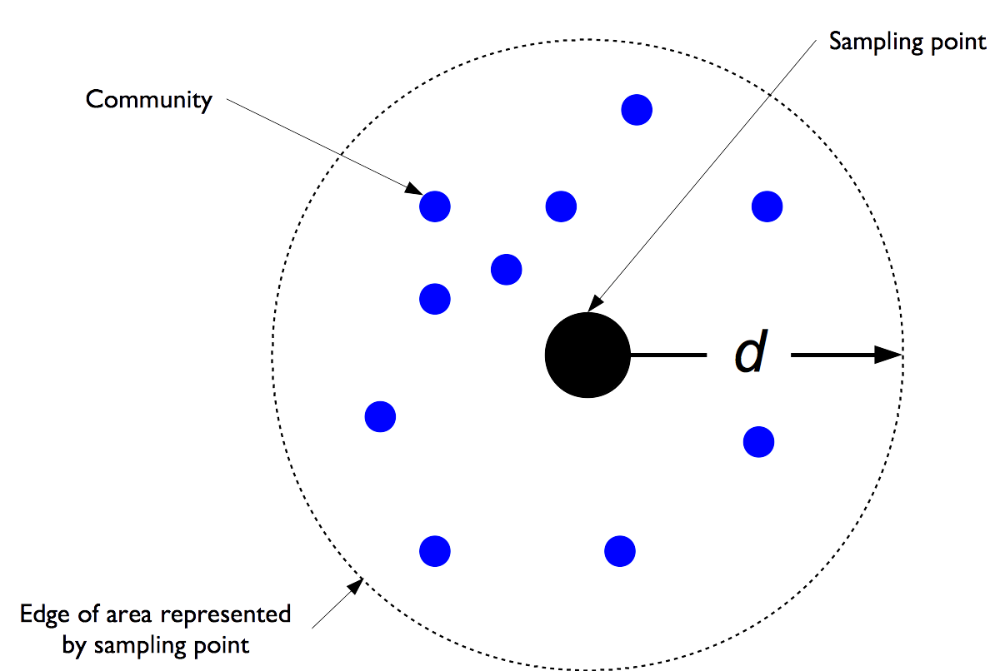
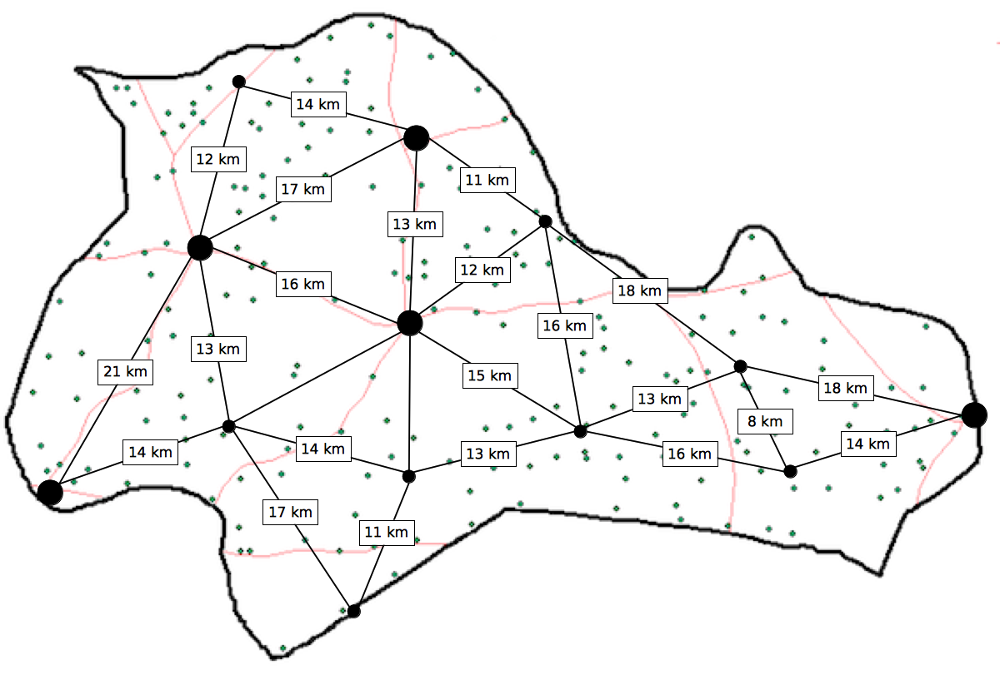
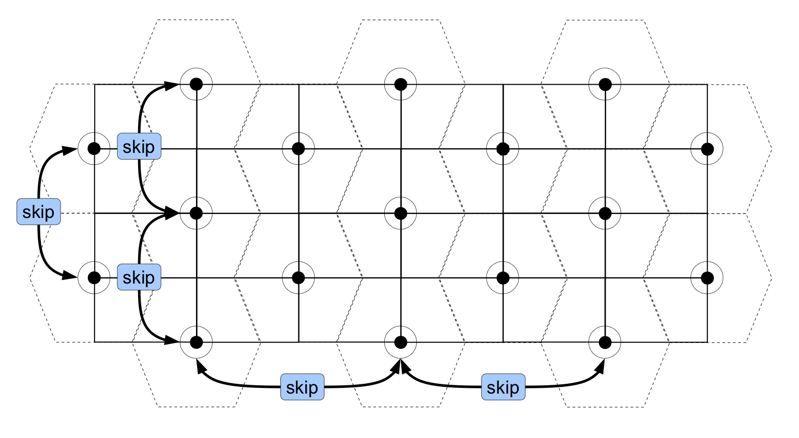
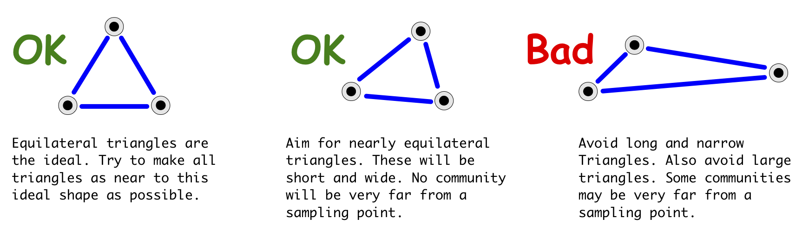
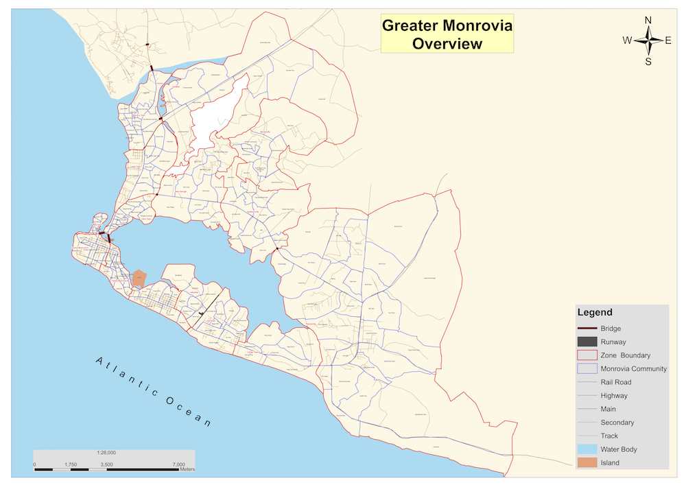

# The survey sample {#sample}

The survey method described here uses a two-stage sample:

* **First-stage:** We take an even (or near-even) spatial sample of communities from all of the communities in the survey area.

* **Second-stage:** We take a sample of eligible individuals from each of the communities identified in the first stage of sampling.

Two-stage sampling is used in many survey methods. A typical example of a survey method that uses a two-stage sample is the SMART method that is commonly used for nutritional anthropometry surveys.

The main difference between the sample taken in S3M based surveys and in SMART type surveys is that S3M based samples use a spatial sample in the first stage whereas SMART type surveys use a proportional to population size (PPS) sample.

The advantages of using a spatial first stage sample is that such a sample allows us to identify where (and why) coverage is good, and where (and why) coverage is poor. This information is essential to improving program coverage and ensuring equitable access to services.

A spatial sample can be used to produce equivalent results to a traditional proportional to population size (PPS) sample as is used in (e.g.) SMART type surveys using a weighted analysis. This means that a spatial sample can be made to act as a PPS sample. A PPS type sample cannot, however, be made to act as a spatial sample.

## The first stage sample {#stage1}

### Step 1: Find a map

The first step in a S3M survey is to find a map of the survey area. A map showing the locations of all towns and villages in the survey area is essential. Try to find a map showing the locations of all towns and villages in the survey area. You may need to update the map to take into account migration and displacement.

For the coverage survey of 2 counties in Liberia, it will be practical and useful to have:

* A small scale-map (a wide area map but with poor detail) of the entire survey area for each of the 2 counties. If the counties are contiguous (i.e., share borders with each other), the small scale map can be of the two counties together. This map does not need to show the location of all towns and villages in the survey area but it gives a general idea of where the 2 counties are located and main towns and locations and roads. Figure \@ref(fig:smallScaleMap) is a small scale map of Liberia showing counties, roads and main towns and locations. Figure \@ref(fig:smallScaleMapCounty) is a small scale map of two counties showing all the districts within the county, roads and main towns and locations.

\newpage

```{r smallScaleMap, echo = FALSE, eval = TRUE, fig.cap = "Small scale map of Liberia showing counties, roads and points of interest", fig.align = "center", fig.width = 10, fig.height = 10, fig.pos = "H", fig.retina = 1}
# Set margins
par(mar = c(0, 0, 0, 0))
# Plot map
plot(liberia::counties, lwd = 2, border = "gray50")
plot(wca, lwd = 4, border = "black", add = TRUE)
plot(primary, lwd = 1, lty = 2, col = "blue", add = TRUE)
plot(paved, lwd = 3, lty = 1, col = "blue", add = TRUE)
plot(poi, pch = 4, cex = 0.3, lwd = 1, col = "darkgreen", add = TRUE)
map.scale()
legend(x = "topright",
       inset = 0.02,
       y.intersp = 1.2,
       bg = "white",
       legend = c("Country borders", "County borders", "Paved roads", 
                  "Primary roads", "Main towns and locations"),
       pch = c(0, 0, NA, NA, 4),
       lty = c(NA, NA, 1, 2, NA),
       lwd = c(3, 2, 2, 1, 2),
       col = c("black", "gray50", "blue", "blue", "darkgreen"),
       cex = 1,
       pt.cex = 2)
```

\newpage

```{r smallScaleMapCounty, echo = FALSE, eval = TRUE, fig.cap = "Small scale map of Montserrado and Grand Bassa in Liberia showing all districts, roads and points of interest", fig.align = "center", fig.width = 6, fig.height = 12, fig.pos = "H", fig.retina = 1}
# Set margins and plot layout
par(mar = c(1, 1, 1, 1), mfrow = c(2, 1))
# Draw first county
plot(subset(districts, admin1Name == "Grand Bassa"), 
     lwd = 1, 
     border = "gray50")
plot(counties, lwd = 1, border = "black", add = TRUE)
plot(wca, lwd = 4, border = "black", add = TRUE)
text(x = counties, 
     labels = counties$admin1name, 
     cex = 2, col = "gray70")
plot(primary, lwd = 1, lty = 2, col = "blue", add = TRUE)
plot(paved, lwd = 3, lty = 1, col = "blue", add = TRUE)
plot(poi, pch = 4, cex = 0.3, lwd = 1, col = "darkgreen", add = TRUE)
map.scale(ratio = FALSE)
# Draw second county
plot(subset(districts, admin1Name == "Montserrado"), 
     lwd = 2, 
     border = "gray50")
plot(counties, lwd = 1, border = "black", add = TRUE)
plot(wca, lwd = 4, border = "black", add = TRUE)
text(x = counties, 
     labels = counties$admin1name, 
     cex = 2, col = "gray70")
plot(primary, lwd = 1, lty = 2, col = "blue", add = TRUE)
plot(paved, lwd = 3, lty = 1, col = "blue", add = TRUE)
plot(poi, pch = 4, cex = 0.3, lwd = 1, col = "darkgreen", add = TRUE)
map.scale(ratio = FALSE)
```

\newpage

* A collection of larger scale maps (a small area map but with good detail) of each of the selected counties and each of the districts within those counties in Liberia. Figure \@ref(fig:largeScaleMapCounty1) is a large scale map of Montserrado county showing all districts, roads and all settlements. Figure \@ref(fig:largeScaleMapDistricts1) is a collection of large scale maps of each of the districts of Montserrado country showing all roads and all settlements.

&nbsp;

```{r largeScaleMapCounty1, echo = FALSE, eval = TRUE, fig.cap = "Large scale map of Montserrado county in Liberia showing all districts, roads and all settlements (towns, villages)", fig.align = "center", fig.width = 10, fig.height = 10, fig.pos = "H", fig.retina = 1}
par(mar = c(0, 0, 0, 0))
plot(subset(liberia::districts, admin1Name == "Montserrado"), lwd = 1, border = "gray50")
plot(liberia::counties, lwd = 4, border = "black", add = TRUE)
plot(wca, lwd = 5, border = "black", add = TRUE)
text(x = subset(counties, admin1name == "Montserrado"), 
     labels = subset(counties, admin1name == "Montserrado")$admin1name, 
     cex = 4, col = "gray70")
raster::text(x = subset(districts, admin1Name == "Montserrado"), 
             labels = subset(districts, admin1Name == "Montserrado")$admin2Name, 
             cex = 1, col = "gray70")
plot(primary, lwd = 2, lty = 2, col = "blue", add = TRUE)
plot(paved, lwd = 2, lty = 1, col = "blue", add = TRUE)
plot(settlements, pch = 4, cex = 0.5, lwd = 1, col = "darkgreen", add = TRUE)
map.scale(ratio = FALSE)
legend(x = "topleft",
       inset = 0.02,
       y.intersp = 1.2,
       bg = "white",
       legend = c("Country borders", "County borders", "Paved roads", 
                  "Primary roads", "All settlements"),
       pch = c(0, 0, NA, NA, 4),
       lty = c(NA, NA, 1, 2, NA),
       lwd = c(3, 2, 2, 1, 2),
       col = c("black", "gray50", "blue", "blue", "darkgreen"),
       cex = 1,
       pt.cex = 2)
```

\newpage

```{r largeScaleMapDistricts1, echo = FALSE, eval = TRUE, fig.cap = "Large scale maps of 5 districts of Montserrado county in Liberia showing roads and all settlements (towns, villages)", fig.align = "center", fig.width = 10, fig.height = 15, fig.pos = "H", fig.retina = 1}
# Set margins and plot layout
par(mar = c(1, 1, 1, 1), mfrow = c(3, 2))
# Plot maps
for(i in subset(districts, admin1Name == "Montserrado")$admin2Name) {
  plot(subset(districts, admin1Name == "Montserrado" & admin2Name == i), 
       lwd = 1, 
       border = "black")
  plot(counties, lwd = 2, border = "black", add = TRUE)
  #sp::plot(wca, lwd = 4, border = "black", add = TRUE)
  text(x = subset(districts, admin1Name == "Montserrado" & admin2Name == i), 
       labels = i, 
       cex = 3, 
       col = "gray70")
  plot(primary, lwd = 1, lty = 2, col = "blue", add = TRUE)
  plot(paved, lwd = 3, lty = 1, col = "blue", add = TRUE)
  plot(settlements, pch = 4, cex = 0.3, lwd = 1, col = "darkgreen", add = TRUE)
  map.scale(ratio = FALSE)
}
```

\newpage

```{r largeScaleMapCounty2, echo = FALSE, eval = TRUE, fig.cap = "Large scale map of Grand Bassa county in Liberia showing all districts, roads and all settlements (towns, villages)", fig.align = "center", fig.width = 10, fig.height = 10, fig.pos = "H", fig.retina = 1}
par(mar = c(0, 0, 0, 0))
plot(grandbassa2, lwd = 1, border = "gray50")
plot(liberia::counties, lwd = 4, border = "black", add = TRUE)
plot(wca, lwd = 5, border = "black", add = TRUE)
text(x = grandbassa1, 
     labels = grandbassa1$admin1name, 
     cex = 4, col = "gray70")
raster::text(x = grandbassa2, 
             labels = grandbassa2$admin2Name, 
             cex = 1, col = "gray70")
plot(primary, lwd = 2, lty = 2, col = "blue", add = TRUE)
plot(paved, lwd = 2, lty = 1, col = "blue", add = TRUE)
plot(settlements, pch = 4, cex = 0.5, lwd = 1, col = "darkgreen", add = TRUE)
map.scale(ratio = FALSE)
legend(x = "topleft",
       inset = 0.02,
       y.intersp = 1.2,
       bg = "white",
       legend = c("Country borders", "County borders", "Paved roads", 
                  "Primary roads", "All settlements"),
       pch = c(0, 0, NA, NA, 4),
       lty = c(NA, NA, 1, 2, NA),
       lwd = c(3, 2, 2, 1, 2),
       col = c("black", "gray50", "blue", "blue", "darkgreen"),
       cex = 1,
       pt.cex = 2)
```

\newpage

```{r largeScaleMapDistricts2, echo = FALSE, eval = TRUE, fig.cap = "Large scale maps of 8 districts of Grand Bassa county in Liberia showing roads and all settlements (towns, villages)", fig.align = "center", fig.width = 10, fig.height = 15, fig.pos = "H", fig.retina = 1}
# Set margins and plot layout
par(mar = c(1, 1, 1, 1), mfrow = c(2, 2))
# Plot maps
for(i in grandbassa2$admin2Name[1:4]) {
  plot(subset(grandbassa2, admin2Name == i), 
       lwd = 1, 
       border = "black")
  plot(counties, lwd = 2, border = "black", add = TRUE)
  #sp::plot(wca, lwd = 4, border = "black", add = TRUE)
  text(x = subset(grandbassa2, admin2Name == i), 
       labels = i, 
       cex = 3, 
       col = "gray70")
  plot(primary, lwd = 1, lty = 2, col = "blue", add = TRUE)
  plot(paved, lwd = 3, lty = 1, col = "blue", add = TRUE)
  plot(settlements, pch = 4, cex = 0.3, lwd = 1, col = "darkgreen", add = TRUE)
  map.scale(ratio = FALSE)
}
```

\newpage

```{r largeScaleMapDistricts3, echo = FALSE, eval = TRUE, fig.cap = "Large scale maps of 8 districts of Grand Bassa county in Liberia showing roads and all settlements (towns, villages) continued", fig.align = "center", fig.width = 10, fig.height = 15, fig.pos = "H", fig.retina = 1}
# Set margins and plot layout
par(mar = c(1, 1, 1, 1), mfrow = c(2, 2))
# Plot maps
for(i in grandbassa2$admin2Name[5:8]) {
  plot(subset(grandbassa2, admin2Name == i), 
       lwd = 1, 
       border = "black")
  plot(counties, lwd = 2, border = "black", add = TRUE)
  #sp::plot(wca, lwd = 4, border = "black", add = TRUE)
  text(x = subset(grandbassa2, admin2Name == i), 
       labels = i, 
       cex = 3, 
       col = "gray70")
  plot(primary, lwd = 1, lty = 2, col = "blue", add = TRUE)
  plot(paved, lwd = 3, lty = 1, col = "blue", add = TRUE)
  plot(settlements, pch = 4, cex = 0.3, lwd = 1, col = "darkgreen", add = TRUE)
  map.scale(ratio = FALSE)
}
```

\newpage

The small-scale maps in Figures \@ref(fig:smallScaleMap) and \@ref(fig:smallScaleMapCounty) will be useful for identifying initial sampling locations. 

The large-scale maps in Figures \@ref(fig:largeScaleMapCounty1), \@ref(fig:largeScaleMapCounty2), \@ref(fig:largeScaleMapDistricts1), \@ref(fig:largeScaleMapDistricts2) and \@ref(fig:largeScaleMapDistricts3) will be useful for identifying the precise location of sampling points and for selecting the communities to be sampled.

\newpage

### Step 2: Decide the area to represent each sampling point

The easiest way of thinking about this is as a function of the intended maximum distance ($d$) of any community from the nearest sampling point (see Figure \@ref(fig:distance1).

&nbsp;

```{r distance1, echo = FALSE, eval = TRUE, fig.cap = "Conceptual presentation of the area represented by each sampling point", fig.align = "center", fig.pos = "H", fig.retina = 1}

```

&nbsp;

There are other ways of thinking about $d$. These are:

1. **The area of each triangular tile**: This can be calculated using the formula:

$$ A ~ = ~ \tan30^ \circ ~ \times ~ \frac{9}{4} ~ d ^ 2 $$

For $d ~ = ~ 10 ~ \text{km}$ the area of each triangular tile will be about:

$$ A ~ = ~ \tan30^ \circ ~ \times ~ \frac{9}{4} ~ d ^ 2 ~ \approx ~ 1.3 ~ \times ~ 100 ~ = ~ 130 ~ \text{km} ^ 2 $$

2. **Practicability**: Most of the time spent in the field when doing a survey will be in travelling to and from sampling points. Having many sampling points can make for an expensive and / or lengthy survey. If you know how many sampling points that you can afford to take ($m$) then you can make a **very approximate** estimate of a suitable value for d using the following *rule-of-thumb* formula:

$$ d ~ \approx ~ \sqrt{\frac{\text{Program Area}}{m}} $$

The value of $d$ calculated using this formula is approximate and should be used as a starting point for a number of trial samples using the procedure outlined below.

&nbsp;

+----------+---------------+----------+---------------+
| **Pair** | **Distance**  | **Pair** | **Distance**  |
+:========:+:=============:+:========:+:=============:+
| 1        | 21 km         | 13       | 13 km         |
+----------+---------------+----------+---------------+
| 2        | 14 km         | 14       | 11 km         |
+----------+---------------+----------+---------------+
| 3        | 13 km         | 15       | 12 km         |
+----------+---------------+----------+---------------+
| 4        | 17 km         | 16       | 15 km         |
+----------+---------------+----------+---------------+
| 5        | 11 km         | 17       | 13 km         |
+----------+---------------+----------+---------------+
| 6        | 14 km         | 18       | 16 km         |
+----------+---------------+----------+---------------+
| 7        | 12 km         | 19       | 18 km         |
+----------+---------------+----------+---------------+
| 8        | 15 km         | 20       | 13 km         |
+----------+---------------+----------+---------------+
| 9        | 16 km         | 21       | 8 km          |
+----------+---------------+----------+---------------+
| 10       | 12 km         | 22       | 16 km         |
+----------+---------------+----------+---------------+
| 11       | 17 km         | 23       | 18 km         |
+----------+---------------+----------+---------------+
| 12       | 14 km         | 24       | 14 km         |
+----------+---------------+----------+---------------+

&nbsp;

```{r distance2, echo = FALSE, eval = TRUE, fig.cap = "Distances of communities to the nearest substantial markets", fig.align = "center", fig.pos = "H", fig.retina = 1}

```

&nbsp;

```{block2, type = "rmdcalc"}
Following are steps to estimate value of $d$ based on distances that carers are willing or able to walk to access services.

&nbsp;

Using the information from the distance table, add the distances together: 
  
$$ \sum \text{Distance} ~ = ~ 343 ~ \text{km} $$

&nbsp;
  
Divide the result by the number of paired distances:
  
$$ \frac{\sum \text{Distance}}{\text{Number of paired distances}} ~ = ~ \frac{343}{24} ~ = ~ 14.29 ~ \text{km} $$

&nbsp;
  
Divide the result by two:
  
$$ d ~ = ~ \frac{14.29}{2} ~ = ~ 7.15 ~ \approx ~ 7 ~ \text{km} $$
```
  
&nbsp;
  
This is an estimate of the distance that carers are willing or able to walk to access services. Only distances between towns and villages with markets are used in this calculation.

A way of deciding a value for $d$ that is based on the economic geography of the survey area is to set $d$ to one half of the mean distance between neighbouring pairs of communities with substantial markets.

S3M surveys have been done using a wide range (i.e. from $d ~ = ~ 8 ~ \text{km}$ to $d ~ = ~ 33 ~ \text{km}$) of values for $d$. A value for $d$ of 10 km or 12 km will probably be small enough in most circumstances.

\newpage

### Step 3: Draw a grid over the map

```{r grid1, echo = FALSE, eval = TRUE, fig.cap = "Montserrado county with a rectangular grid defined by d of 6 km", fig.align = "center", fig.width = 8, fig.height = 8, fig.pos = "H", fig.retina = 1}
par(mar = c(0, 0, 0, 0))
plot(montserradoGrid, lty = 0)
plot(counties, add = TRUE)
plot(montserrado1, lwd = 3, add = TRUE)
plot(primary, lwd = 2, lty = 2, col = "blue", add = TRUE)
plot(paved, lwd = 2, lty = 1, col = "blue", add = TRUE)
plot(settlements, pch = 4, cex = 0.5, lwd = 1, col = "darkgreen", add = TRUE)
plot(montserradoGrid, add = TRUE)
legend(x = "topleft",
       inset = 0.02,
       y.intersp = 1.2,
       bg = "white",
       legend = c("County borders", "Montserrado borders", "Paved roads", 
                  "Primary roads", "All settlements"),
       pch = c(0, 0, NA, NA, 4),
       lty = c(NA, NA, 1, 2, NA),
       lwd = c(1, 3, 2, 2, 2),
       col = c("black", "black", "blue", "blue", "darkgreen"),
       cex = 1,
       pt.cex = 2)
map.scale()
```

\newpage

```{r grid1a, echo = FALSE, eval = TRUE, fig.cap = "Grand Bassa county with a rectangular grid defined by d of 10 km", fig.align = "center", fig.width = 8, fig.height = 8, fig.pos = "H", fig.retina = 1}
par(mar = c(0, 0, 0, 0))
plot(grandbassaGrid, lty = 0)
plot(counties, add = TRUE)
plot(grandbassa1, lwd = 3, add = TRUE)
plot(primary, lwd = 2, lty = 2, col = "blue", add = TRUE)
plot(paved, lwd = 2, lty = 1, col = "blue", add = TRUE)
plot(settlements, pch = 4, cex = 0.5, lwd = 1, col = "darkgreen", add = TRUE)
plot(grandbassaGrid, add = TRUE)
legend(x = "topleft",
       inset = 0.02,
       y.intersp = 1.2,
       bg = "white",
       legend = c("County borders", "Grand Bassa borders", "Paved roads", 
                  "Primary roads", "All settlements"),
       pch = c(0, 0, NA, NA, 4),
       lty = c(NA, NA, 1, 2, NA),
       lwd = c(1, 3, 2, 2, 2),
       col = c("black", "black", "blue", "blue", "darkgreen"),
       cex = 1,
       pt.cex = 2)
map.scale()
```

&nbsp;

The next step is to draw a grid over the map.

The size of the grid is determined by the distance ($d$) that you decided in **Step 2**.

The grid is rectangular rather than square. This allows us to place sampling points at the centres of hexagons in a hexagonal grid without the need to draw a hexagonal grid (see **Step 4**).

The width of the grid in the east-west ($x$) direction is different from the height of the grid in the north-south ($y$) direction.

The width of the grid in the east-west ($x$) direction is calculated using:

$$ x ~ = ~ \frac{3d}{2} $$

where $d$ is the distance ($d$) that you decided in **Step 2**.

The height of the grid in the north-south ($y$) direction can be calculated using:

$$ y ~ = ~ \frac{\sqrt{3}d}{2} $$

where $d$ is the distance ($d$) that you decided in **Step 2**.

For example, in Figure \@ref(fig:grid1), we used $d ~ = ~ 6 ~ \text{km}$. This value of $d$ creates a rectangular grid with the following dimensions:

$$ x ~ = ~ \frac{3d}{2} ~ = ~ \frac{3 ~ \times ~ 6}{2} ~ = ~ \frac{18}{2} ~ = ~ 9 ~ \text{km} $$

and:

$$ y ~ = ~ \frac{\sqrt{3}d}{2} ~ \approx ~ \frac{1.73 ~ \times ~ 6}{2} ~ \approx ~ \frac{10.38}{2} ~ \approx ~ 5.2 ~ \text{km} $$

So, the grid in Figure \@ref(fig:grid1) is 9 km long on the east-west direction and 5.2 km on the north and south direction.

\newpage

The table below shows the grid sizes for different values of $d$:

+--------+------------+------------+-----+--------+------------+------------+
| **d**  | **x**      | **y**      |     | **d**  | **x**      | **y**      |
+=======:+===========:+===========:+=====+=======:+===========:+===========:+
| 5      | 7.5        | 4.3        |     | 13     | 19.5       | 11.3       |
+--------+------------+------------+-----+--------+------------+------------+
| 6      | 9.0        | 5.2        |     | 14     | 21.0       | 12.1       |
+--------+------------+------------+-----+--------+------------+------------+
| 7      | 10.5       | 6.1        |     | 15     | 22.5       | 13.0       |
+--------+------------+------------+-----+--------+------------+------------+
| 8      | 12.0       | 6.9        |     | 16     | 24.0       | 13.9       |
+--------+------------+------------+-----+--------+------------+------------+
| 9      | 13,5       | 7.8        |     | 17     | 25.5       | 14.7       |
+--------+------------+------------+-----+--------+------------+------------+
| 10     | 15.0       | 8.7        |     | 18     | 27.0       | 15.6       |
+--------+------------+------------+-----+--------+------------+------------+
| 11     | 16.5       | 19.5       |     | 19     | 28.5       | 16.5       |
+--------+------------+------------+-----+--------+------------+------------+
| 12     | 18.0       | 10.4       |     | 20     | 30.0       | 17.3       |
+--------+------------+------------+-----+--------+------------+------------+

When drawing the grid make sure that it covers the entire survey area.

It is usually best to draw a grid that covers an area that is a little larger than the entire survey area. This helps to ensure that the survey will sample from the entire survey area.

The grid can be drawn using marker pens onto plastic film overlaying the map. This protects the map and allows you to reposition the grid to improve the coverage of the sample should this be needed.

If you are drawing the grid directly onto the map then use a soft pencil (e.g. a *2B* or *#1* pencil). A soft pencil will not damage the surface of the map and is easy to erase using a soft rubber eraser should you make a mistake or need to draw a different grid.

\newpage

### Step 4: Create an even spread of sampling points

```{r grid2, echo = FALSE, eval = TRUE, fig.cap = "Montserrado county with a rectangular grid defined by d of 6 km and alternating intersections of the grid used to identify sampling points", fig.align = "center", fig.width = 8, fig.height = 8, fig.pos = "H", fig.retina = 1}
par(mar = c(0, 0, 0, 0))
plot(montserradoGrid, lty = 0)
plot(counties, add = TRUE)
plot(montserrado1, lwd = 3, add = TRUE)
plot(primary, lwd = 2, lty = 2, col = "blue", add = TRUE)
plot(paved, lwd = 2, lty = 1, col = "blue", add = TRUE)
plot(settlements, pch = 4, cex = 0.5, lwd = 1, col = "darkgreen", add = TRUE)
plot(montserradoGrid, add = TRUE)
plot(montserradoSP, pch = 1, cex = 2, col = "red", add = TRUE)
legend(x = "topleft",
       inset = 0.02,
       y.intersp = 1.2,
       bg = "white",
       legend = c("County borders", "Montserrado borders", "Paved roads", 
                  "Primary roads", "All settlements", "Sampling points"),
       pch = c(0, 0, NA, NA, 4, 1),
       lty = c(NA, NA, 1, 2, NA, NA),
       lwd = c(1, 3, 2, 2, 2, 2),
       col = c("black", "black", "blue", "blue", "darkgreen", "red"),
       cex = 1,
       pt.cex = 2)
map.scale()
```

\newpage

```{r grid2a, echo = FALSE, eval = TRUE, fig.cap = "Grand Bassa county with a rectangular grid defined by d of 10 km and alternating intersections of the grid used to identify sampling points", fig.align = "center", fig.width = 8, fig.height = 8, fig.pos = "H", fig.retina = 1}
par(mar = c(0, 0, 0, 0))
plot(grandbassaGrid, lty = 0)
plot(counties, add = TRUE)
plot(grandbassa1, lwd = 3, add = TRUE)
plot(primary, lwd = 2, lty = 2, col = "blue", add = TRUE)
plot(paved, lwd = 2, lty = 1, col = "blue", add = TRUE)
plot(settlements, pch = 4, cex = 0.5, lwd = 1, col = "darkgreen", add = TRUE)
plot(grandbassaGrid, add = TRUE)
plot(grandbassaSP, pch = 1, cex = 2, col = "red", add = TRUE)
legend(x = "bottomright",
       inset = 0.02,
       y.intersp = 1.2,
       bg = "white",
       legend = c("County borders", "Grand Bassa borders", "Paved roads", 
                  "Primary roads", "All settlements", "Sampling points"),
       pch = c(0, 0, NA, NA, 4, 1),
       lty = c(NA, NA, 1, 2, NA, NA),
       lwd = c(1, 3, 2, 2, 2, 2),
       col = c("black", "black", "blue", "blue", "darkgreen", "red"),
       cex = 1,
       pt.cex = 2)
map.scale()
```

Sampling points are located at the intersections of the rectangular grid in a staggered fashion. Alternate intersections of the grid in the x (east-west) and y (north-south) directions are used:

\newpage

```{r grid2b, echo = FALSE, eval = TRUE, fig.cap = "Selecting alternating intersections of the grid in the x and y directions to spread sampling points evenly", fig.align = "center", fig.pos = "H", fig.retina = 1}

```

Note how this process places sampling points at the centres of hexagons in a hexagonal grid without the need to draw a hexagonal grid.

Make sure that your sample points go right to the edge (or even over the edge) of the survey area. This helps to ensure that the survey will sample from the entire survey area.

\newpage

### Step 5: Select the communities to sample

```{r grid3, echo = FALSE, eval = TRUE, fig.cap = "Montserrado county with a rectangular grid defined by d of 6 km and sampling points moved to the nearest communities", fig.align = "center", fig.width = 8, fig.height = 8, fig.pos = "H", fig.retina = 1}

xx <- get_nearest_point(data = settlements[settlements$admin1Name == "Montserrado", ], 
                        data.x = "COORD_X", 
                        data.y = "COORD_Y", 
                        query = montserradoSP)

par(mar = c(0, 0, 0, 0))
plot(montserradoGrid, lty = 0)
plot(counties, add = TRUE)
plot(montserrado1, lwd = 3, add = TRUE)
plot(primary, lwd = 2, lty = 2, col = "blue", add = TRUE)
plot(paved, lwd = 2, lty = 1, col = "blue", add = TRUE)
plot(settlements, pch = 4, cex = 0.5, lwd = 1, col = "darkgreen", add = TRUE)
plot(montserradoGrid, add = TRUE)
points(xx[ , c("COORD_X", "COORD_Y")], pch = 1, cex = 2, col = "red")
legend(x = "topleft",
       inset = 0.02,
       y.intersp = 1.2,
       bg = "white",
       legend = c("County borders", "Montserrado borders", "Paved roads", 
                  "Primary roads", "All settlements", "Sampling points"),
       pch = c(0, 0, NA, NA, 4, 1),
       lty = c(NA, NA, 1, 2, NA, NA),
       lwd = c(1, 3, 2, 2, 2, 2),
       col = c("black", "black", "blue", "blue", "darkgreen", "red"),
       cex = 1,
       pt.cex = 2)
map.scale()
```

\newpage

```{r grid4, echo = FALSE, eval = TRUE, fig.cap = "Grand Bassa county with a rectangular grid defined by d of 10 km and sampling points moved to the nearest communities", fig.align = "center", fig.width = 8, fig.height = 8, fig.pos = "H", fig.retina = 1}

yy <- get_nearest_point(data = settlements[settlements$admin1Name == "Grand Bassa", ], 
                        data.x = "COORD_X", 
                        data.y = "COORD_Y", 
                        query = grandbassaSP)

par(mar = c(0, 0, 0, 0))
plot(grandbassaGrid, lty = 0)
plot(counties, add = TRUE)
plot(grandbassa1, lwd = 3, add = TRUE)
plot(primary, lwd = 2, lty = 2, col = "blue", add = TRUE)
plot(paved, lwd = 2, lty = 1, col = "blue", add = TRUE)
plot(settlements, pch = 4, cex = 0.5, lwd = 1, col = "darkgreen", add = TRUE)
plot(grandbassaGrid, add = TRUE)
points(yy[ , c("COORD_X", "COORD_Y")], pch = 1, cex = 2, col = "red")
legend(x = "bottomright",
       inset = 0.02,
       y.intersp = 1.2,
       bg = "white",
       legend = c("County borders", "Grand Bassa borders", "Paved roads", 
                  "Primary roads", "All settlements", "Sampling points"),
       pch = c(0, 0, NA, NA, 4, 1),
       lty = c(NA, NA, 1, 2, NA, NA),
       lwd = c(1, 3, 2, 2, 2, 2),
       col = c("black", "black", "blue", "blue", "darkgreen", "red"),
       cex = 1,
       pt.cex = 2)
map.scale()
```

Select the community (or communities) closest to the sampling points identified in **Step 4**.

The position of the sampling point is moved to the position of the selected community. This is shown in the
diagram above.

You may drop sampling points if you find that many sampling points are clustered closely together.

You may move or add sampling points if you find that there are populated areas that do not contain sampling points.

The aim is to create a roughly even spread of sampling points over the entire survey area.

```{block2, type = "rmdcaution"}
The S3M sample is defined using a systematic sampling method. Like any systematic sampling method, an S3M sample can produce biased estimates if there is periodic variation in prevalence and / or coverage and the sampling points tend to coincide with this periodicity. This is difficult to control for without prior knowledge of the periodic variation, although simple checks such as ensuring that sampling points are not all in valleys or all on hilltops, and adjusting the grid position accordingly, should help to minimise this problem.
```

```{r grid3a, echo = FALSE, eval = TRUE, fig.cap = "Montserrado county with a rectangular grid defined by d of 6 km and sampling points moved to the nearest communities showing test triangulation", fig.align = "center", fig.width = 8, fig.height = 8, fig.pos = "H", fig.retina = 1}

triSP <- get_tri(input = xx, x = "COORD_X", y = "COORD_Y", qTSL = 0.9)

par(mar = c(0, 0, 0, 0))
plot(montserradoGrid, lty = 0)
plot(counties, add = TRUE)
plot(montserrado1, lwd = 3, add = TRUE)
plot(primary, lwd = 2, lty = 2, col = "blue", add = TRUE)
plot(paved, lwd = 2, lty = 1, col = "blue", add = TRUE)
plot(settlements, pch = 4, cex = 0.5, lwd = 1, col = "darkgreen", add = TRUE)
plot(montserradoGrid, add = TRUE)
points(xx[ , c("COORD_X", "COORD_Y")], pch = 1, cex = 2, col = "red")
plot(triSP, border = "red", lwd = 2, add = TRUE)
text(xx[ , c("COORD_X", "COORD_Y")], labels = 1:nrow(xx))
legend(x = "topleft",
       inset = 0.02,
       y.intersp = 1.2,
       bg = "white",
       legend = c("County borders", "Montserrado borders", "Paved roads", 
                  "Primary roads", "All settlements", "Sampling points"),
       pch = c(0, 0, NA, NA, 4, 1),
       lty = c(NA, NA, 1, 2, NA, NA),
       lwd = c(1, 3, 2, 2, 2, 2),
       col = c("black", "black", "blue", "blue", "darkgreen", "red"),
       cex = 1,
       pt.cex = 2)
map.scale()
```

```{r grid4a, echo = FALSE, eval = TRUE, fig.cap = "Grand Bassa county with a rectangular grid defined by d of 10 km and sampling points moved to the nearest communities showing test triangulation", fig.align = "center", fig.width = 8, fig.height = 8, fig.pos = "H", fig.retina = 1}

triSP <- get_tri(input = yy, x = "COORD_X", y = "COORD_Y", qTSL = 0.9)

par(mar = c(0, 0, 0, 0))
plot(grandbassaGrid, lty = 0)
plot(counties, add = TRUE)
plot(grandbassa1, lwd = 3, add = TRUE)
plot(primary, lwd = 2, lty = 2, col = "blue", add = TRUE)
plot(paved, lwd = 2, lty = 1, col = "blue", add = TRUE)
plot(settlements, pch = 4, cex = 0.5, lwd = 1, col = "darkgreen", add = TRUE)
plot(grandbassaGrid, add = TRUE)
points(yy[ , c("COORD_X", "COORD_Y")], pch = 1, cex = 2, col = "red")
plot(triSP, border = "red", lwd = 2, add = TRUE)
text(yy[ , c("COORD_X", "COORD_Y")], labels = 1:nrow(yy))
legend(x = "bottomright",
       inset = 0.02,
       y.intersp = 1.2,
       bg = "white",
       legend = c("County borders", "Grand Bassa borders", "Paved roads", 
                  "Primary roads", "All settlements", "Sampling points"),
       pch = c(0, 0, NA, NA, 4, 1),
       lty = c(NA, NA, 1, 2, NA, NA),
       lwd = c(1, 3, 2, 2, 2, 2),
       col = c("black", "black", "blue", "blue", "darkgreen", "red"),
       cex = 1,
       pt.cex = 2)
map.scale()
```

A good way to check if you have an even spread of sampling points over the entire survey area is to do a trial *triangulation* of the selected sampling points. This involves dividing up the survey area into non-overlapping triangles with a sampling point at each vertex.

There will usually be many ways to divide the survey area into triangles. The best triangulation is one that results in small equilateral triangles (i.e. triangles with all sides of equal length) or small and nearly equilateral triangles. Avoid long and narrow triangles. Avoid large triangles.

```{r grid3b, echo = FALSE, eval = TRUE, fig.cap = "Selecting alternating intersections of the grid in the x and y directions to spread sampling points evenly", fig.align = "center", fig.pos = "H", fig.retina = 1}

```

You can triangulate “by eye” or automatically (i.e. using a computer). If you use a computer to do this then you should use software that produces a *Delaunay triangulation*.

You may drop sampling points if you find that many sampling points are clustered closely together.

You may move or add sampling points if you find that there are populated areas that do not contain sampling points.

The aim is to create a roughly even spread of sampling points over the entire survey area.

\newpage

```{r grid3c, echo = FALSE, eval = TRUE, fig.cap = "Montserrado county with a rectangular grid defined by d of 6 km and sampling points moved to the nearest communities showing updated triangulation", fig.align = "center", fig.width = 8, fig.height = 8, fig.pos = "H", fig.retina = 1}

triSP <- get_tri(input = xx[!1:nrow(xx) %in% c(2, 25, 32, 33, 39), ], 
                 x = "COORD_X", y = "COORD_Y", qTSL = 0.9)

par(mar = c(0, 0, 0, 0))
plot(montserradoGrid, lty = 0)
plot(counties, add = TRUE)
plot(montserrado1, lwd = 3, add = TRUE)
plot(primary, lwd = 2, lty = 2, col = "blue", add = TRUE)
plot(paved, lwd = 2, lty = 1, col = "blue", add = TRUE)
plot(settlements, pch = 4, cex = 0.5, lwd = 1, col = "darkgreen", add = TRUE)
plot(montserradoGrid, add = TRUE)
points(xx[ , c("COORD_X", "COORD_Y")], 
       pch = ifelse(1:nrow(xx) %in% c(2, 25, 32, 33, 39), 20, 1), 
       cex = ifelse(1:nrow(xx) %in% c(2, 25, 32, 33, 39), 4, 2), 
       col = ifelse(1:nrow(xx) %in% c(2, 25, 32, 33, 39), "yellow", "red"))
plot(triSP, border = "red", lwd = 2, add = TRUE)
text(xx[ , c("COORD_X", "COORD_Y")], labels = 1:nrow(xx))
legend(x = "topleft",
       inset = 0.02,
       y.intersp = 1.2,
       bg = "white",
       legend = c("County borders", "Montserrado borders", "Paved roads", 
                  "Primary roads", "All settlements", "Sampling points", 
                  "Dropped sampling points"),
       pch = c(0, 0, NA, NA, 4, 1, 20),
       lty = c(NA, NA, 1, 2, NA, NA, NA),
       lwd = c(1, 3, 2, 2, 2, 2, 2),
       col = c("black", "black", "blue", "blue", "darkgreen", "red", "yellow"),
       cex = 1,
       pt.cex = 2)
map.scale()
```

```{r grid4c, echo = FALSE, eval = TRUE, fig.cap = "Grand Bassa county with a rectangular grid defined by d of 10 km and sampling points moved to the nearest communities showing updated triangulation", fig.align = "center", fig.width = 8, fig.height = 8, fig.pos = "H", fig.retina = 1}

triSP <- get_tri(input = yy[!1:nrow(yy) %in% c(3, 4, 8, 10, 11, 12, 17, 26, 28, 
                                               35, 39, 42, 43, 47, 48, 54, 62), ], 
                 x = "COORD_X", y = "COORD_Y", qTSL = 0.9)

par(mar = c(0, 0, 0, 0))
plot(grandbassaGrid, lty = 0)
plot(counties, add = TRUE)
plot(grandbassa1, lwd = 3, add = TRUE)
plot(primary, lwd = 2, lty = 2, col = "blue", add = TRUE)
plot(paved, lwd = 2, lty = 1, col = "blue", add = TRUE)
plot(settlements, pch = 4, cex = 0.5, lwd = 1, col = "darkgreen", add = TRUE)
plot(grandbassaGrid, add = TRUE)
points(yy[ , c("COORD_X", "COORD_Y")], 
       pch = ifelse(1:nrow(yy) %in% c(3, 4, 8, 10, 11, 12, 17, 26, 28, 35, 
                                      39, 42, 43, 47, 48, 54, 62), 20, 1), 
       cex = ifelse(1:nrow(yy) %in% c(3, 4, 8, 10, 11, 12, 17, 26, 28, 35, 
                                      39, 42, 43, 47, 48, 54, 62), 4, 2), 
       col = ifelse(1:nrow(yy) %in% c(3, 4, 8, 10, 11, 12, 17, 26, 28, 35, 
                                      39, 42, 43, 47, 48, 54, 62), "yellow", "red"))
plot(triSP, border = "red", lwd = 2, add = TRUE)
text(yy[ , c("COORD_X", "COORD_Y")], labels = 1:nrow(yy))
legend(x = "bottomright",
       inset = 0.02,
       y.intersp = 1.2,
       bg = "white",
       legend = c("County borders", "Grand Bassa borders", "Paved roads", 
                  "Primary roads", "All settlements", "Sampling points", 
                  "Dropped sampling points"),
       pch = c(0, 0, NA, NA, 4, 1, 20),
       lty = c(NA, NA, 1, 2, NA, NA, NA),
       lwd = c(1, 3, 2, 2, 2, 2, 2),
       col = c("black", "black", "blue", "blue", "darkgreen", "red", "yellow"),
       cex = 1,
       pt.cex = 2)
map.scale()
```

Figure \@ref(fig:grid3c) above show a trial triangulation for Montserrado county with only a few long and narrow triangles. Five sampling points (labelled 2, 25, 32, 33, 39) have been dropped to ensure that there are few long and narrow triangles.

Figure \@ref(fig:grid4c) above show a trial triangulation for Grand Bassa county with only a few long and narrow triangles. Seventeen sampling points (labelled 3, 4, 8, 10, 11, 12, 17, 26, 28, 35, 39, 42, 43, 47, 48, 54, 62) have been dropped to ensure that there are a few long and narrow triangles.

\newpage

**The sample will, to some extent, be dictated by the distribution of communities in the survey area. It is usual to find that you have some large triangles and some long and narrow triangles in your final triangulation. You should try to keep the number of these “problem” triangles to a minimum.**

The process of selecting communities to sample is:

1. Start by defining the sample using the grid based approach outlined above.

2. Use a trial triangulation. This can be done “by eye” or using a computer. Check for an even spatial sample:

* Most triangles should be short and wide.

* Very few triangles should be long and narrow.

* The triangles should be of roughly equal size.

* The complete set of triangles should cover all (or almost all) of the survey area.

3. Move or add sampling points to improve the sample (i.e. to avoid long and narrow triangles, to avoid large triangles, to make triangles roughly equal in size, and to ensure the sample covers all or almost all of the survey area). Triangulate again. Repeat this process until you are happy with the sample.

## The second stage sample {#stage2}

The second stage sample is also called *within-community sampling*. The sampling process that you use to select a sample from a community will depend on what the survey is investigating.

If you are investigating multiple indicators which apply to different groups of individuals then you may find it easier to use different sampling methods for different indicators. You can think of this as having different surveys for different indicators sampled from the same set of communities at the same time. For the Liberia S3M, this is the approach that will be used in which there will be 2 concurrent surveys. There will be a survey for CMAM coverage which will be specific for SAM children and a survey for children aged 6 - 59 months and their mothers.

### Stage 2 sampling for CMAM coverage survey

For the survey for CMAM coverage, an active and adaptive (snowball) case-finding method can be used in stage 2 sampling to find all or nearly all SAM cases by MUAC in the stage 1 sample [@Myatt:2012tt]. However, given that the Liberia CMAM programme uses both MUAC and weight-for-height as independent criteria for SAM, it is uncertain whether the use of active and adaptive case finding using weight-for-height will find all or nearly all SAM cases by weight-for-height[^1]. It is therefore recommended that a full census of children aged 6-59 months in the selected villages in the stage 1 sample be conducted to ensure exhaustivity. This will also be the approach to use in urban areas given that active and adaptive case finding has been known to fail in finding all SAM cases when implemented in urban areas [@Myatt:2012tt]. As an example, the only other known coverage survey conducted in Liberia is that which was conducted by Accion contra la faim in 2011 to assess coverage of CMAM in Greater Monrovia [@AccionContralaFaim:2011vu]. In this survey, it was unclear as to whether both MUAC and weight-for-height was used to identify SAM but both active adaptive case finding and mass screening was used to ensure that all or nearly all CAM cases are found. Doing both approaches will be too resource-intensive. A good census sample taken house-to-house or door-to-door should be sufficient. 

### Stage 2 sampling for children 6-59 months and their mothers

Given that the stage 2 sample for the CMAM coverage survey will utilise a house-to-house or door-to-door of the villages, the stage 2 sample for the survey of children 6-59 months old and their mothers can be done via door/house counting with systematic selection in the first village selected per sampling point.

Generally, in rural villages/communities, the village leader will know how many houses/households are in the village so they can be asked for this information. In urban locations/communities/blocks, this information isn't usually known. So, door counting of the urban location or block will be necessary to know the total number of doors/houses in that particular urban area/location.

Once the number of houses or number of doors has been established, a sampling interval will need to be calculated as follows:

&nbsp;

$$ n_{\text{Sampling interval}} ~ = ~ \frac{\text{Total number of houses/doors}}{\text{Target sample of children 6-59 months old in village}} $$

&nbsp;

The house-to-house/door-to-door sampling to look for SAM children can start and then for every $nth$ house/door, the survey for children 6-59 months old will be conducted as well.

Remember that this will be done in the first village selected per sampling point.

### Special considerations for large villages

If a sampling point is located in a large village or town then the village or town can be divided into a set of segments and the entire population of only a sample of these segments are then fully enumerated for the SAM coverage survey. If this village is the first village of the sampling point, then the door/house counting with systematic selection will be applied only in the sample of segments selected.

**Segmentation** involves dividing a community into several parts and taking part of the within-community sample from each **segment**. With simple communities, segmentation is not required and we take a single sample from the entire community using the appropriate sampling method.

#### Segmentation

For more complicated communities we divide the community into several parts or segments, such as a community made up of several clusters:

```{r sample17, echo = FALSE, fig.cap = "Example of a set of clusters of dwellings", fig.align = "center", fig.pos = "H", fig.retina = 1}
knitr::include_graphics("figures/stage2sample3.png")
```

or a community made up of several ribbons:

```{r sample18, echo = FALSE, fig.cap = "Dwellings arranged in several lines", fig.align = "center", fig.pos = "H", fig.retina = 1}
knitr::include_graphics("figures/stage2sample4.png")
```

or a mixed community:

```{r sample19, echo = FALSE, fig.cap = "Mixture of clusters and ribbons", fig.align = "center", fig.pos = "H", fig.retina = 1}
knitr::include_graphics("figures/stage2sample5.png")
```

Segments should be either ribbons or clusters but should **never** contain both a ribbon and a cluster. This is because clusters and ribbons are sampled in different ways.

To select which segments to sample in a very large village or in urban locations/blocks, draw a rough map of the village and number each segment. Then depending on how many segments have been decided to sample (or are able to be sampled), select randomly the numbered segments. The selected segments are then sampled house-to-house/door-to-door. If this village is the first village of the sampling point, then the door/house counting with systematic selection will be applied only in these selected segments.

## Sample size considerations {#samplesize}

In general, the sample size needed for proportion-type indicators such as those to reported for this survey can be calculated using the following equation.

$$\begin{aligned}
n & ~ = ~ Z^2 ~ \times ~ \frac{p(1 ~ - ~ p)}{c ^ 2} \\
\\
where: & \\
\\
Z & ~ = ~ \text{z-value for preferred confidence interval} \\
p & ~ = ~ \text{expected indicator proportion/prevalence} \\
c & ~ = ~ \text{level of precision}
\end{aligned}$$

The $Z$ value is usually 1.96 for a 95% confidence interval. The $p$ should usually be based on previous coverage results if available. If not, it is usually appropriate to set $p$ at 50\% (0.5) as this results in the highest sample size estimate. The precision ($c$) for coverage surveys is usually set at ±10% based on standard precision used for immunisation coverage.

Using these values, the typical sample size needed for coverage surveys is about 96.

$$ n ~ = ~ 1.96^2 ~ \times ~ \frac{0.5(1 ~ - ~ 0.5)}{0.10 ^ 2} ~ \approx ~  96 $$

However, the survey design needs to be taken into account. A cluster survey such as the one that is proposed for the Liberia S3M will need to inflate sample sizes to account for the loss of variance due to the cluster design. This inflation factor is called the *design effect* (*DEFF*) which is based on the *intracluster correlation coefficient* (*ICC*).

Generally, a *DEFF* of 2 is used to multiply the sample size with to account for the loss of variance. This would mean that a sample size of 192 would be the target sample size.

The sample size required will also depend on the indicators being assessed. Following is a further discussion of sample size requirements for the CMAM coverage survey and for the survey for children 6-59 months and their mothers.

### Sample size for the CMAM coverage survey

SAM treatment coverage can be demonstrated in the following equation:

$$ \text{SAM treatment coverage} ~ = ~ \frac{\text{SAM cases in treatment}}{\text{Total SAM cases}} $$

This indicator requires a sample of under 5 children who have SAM. SAM children are rare (at most 3\% of the general population of children under 5). This means that the universe population of SAM children is small hence a finite population correction can be applied to sample size calculations. At the same time, given the active adaptive case finding approach that will be applied to finding SAM cases is know to be exhaustive, *DEFF* would generally be close to 1. Therefore, a sample size of about 96 is generally big enough to estimate SAM treatment coverage with a ±10\% precision.

### Survey for children aged 6-59 months and their mothers

For vitamin A supplementation, micronutrient powder supplementation, IYCF counselling and ferrous sulphate-folic acid supplementation the sample size of 192 would be the target sample size for each of these indicators.

However, given that this is a compound sample such that the MNP supplementation indicator is only for children 6-23 months old, the 192 sample will need to be inflated for the sample of children 6-59 months old big enough to ensure that at least 192 children aged 6-23 months will be included in the sample. The factor by which to inflate the sample size for children 6-59 months old can be estimated as follows:

&nbsp;

$$ \frac{\text{Age range in months for 6-59 month old children}}{\text{Age range in months for 6-23 month old children}} ~ = ~ \frac{59 - 6}{23 - 6} ~ = ~ \frac{53}{7} ~ \approx ~ 3 $$

&nbsp;

The sample size for children aged 6-59 months old will need to be inflated 3 times to ensure that a minimum sample size of 192 children aged 6-23 months will be sampled.

So, our sample size for the survey for children 6-59 months old and their mothers will be 576.

## Urban and rural sample considerations {#urbanrural}

Currently, the requirements for the survey is to provide coverage estimates for Montserrado rural districts and the whole Grand Bassa county. Urban areas have been specifically excluded.

Given that urban areas would most likely have different characteristics than rural areas, it is more reasonable to treat urban areas as a separate survey area. If urban areas are to be sampled, then urban areas should have its own sample with the same minimum sample size as described above. The implication of this would be an extra survey for each and every urban area to be assessed.

## Overall sampling frame {#samplingframe}

Given the stage 1 sampling, stage 2 sampling and sample size considerations described above, following are the overall sampling frames for each of two surveys that will be conducted.

### Sampling frame for the CMAM coverage survey

Using an S3M approach to stage 1 sampling, thirty (30) stage 1 sampling points will be identified. This is an adaptation of S3M such that instead of first specifying a $d$ value, a minimum number of stage 1 samples is specified based on which the hexagonal grid across each county will be drawn. This would mean that each county will be divided into 30 hexagonal, non-overlapping grids to identify 30 sampling points as the stage 1 sample. If estimates for urban areas will be required, then the urban areas of each county will be separated and a separate grid of 30 hexagons will be drawn on the map of the urban areas.

UNICEF has selected Greater Monrovia District and Grand Bassa County as the areas for the Liberia survey.

The Liberia Institute of Statistics and Geo-Informatic Services (LISGIS) has provided PDF maps of Greater Monrovia District and Grand Bassa County shown below.

&nbsp;

```{r sample20, echo = FALSE, fig.cap = "Map of Greater Monrovia", fig.align = "center", fig.pos = "H", fig.retina = 1}

```

&nbsp;

```{r sample21, echo = FALSE, fig.cap = "Map of Grand Bassa", fig.align = "center", fig.pos = "H", fig.retina = 1}
knitr::include_graphics("figures/grandBassaEA.png")
```

&nbsp;

Thirty hexagonal grids are then laid on top of these maps.

&nbsp;

```{r sample22, echo = FALSE, eval = TRUE, fig.cap = "Thirty hexagonal grids laid on the  map of Greater Monrovia District", fig.align = "center", fig.pos = "H", fig.retina = 1}
gm1 <- districts[districts$admin2Name == "Greater Monrovia", ]

gm1sp <- create_sp_grid(x = gm1,
                        country = "Liberia",
                        buffer = 1,
                        n = 30, n.factor = 5, 
                        type = "s3m", 
                        fixed = TRUE)

gm1grid <- HexPoints2SpatialPolygons(gm1sp)

par(mar = c(0, 0, 0, 0))
plot(gm1, lty = 0)
plot(districts, add = TRUE)
plot(gm1, lwd = 3, add = TRUE)
plot(settlements, pch = 4, cex = 0.5, lwd = 1, col = "darkgreen", add = TRUE)
plot(gm1sp, pch = 1, col = "red", cex = 1, add = TRUE)
plot(gm1grid, lwd = 1, border = "blue", add = TRUE)
```

&nbsp;

```{r sample23, echo = FALSE, eval = TRUE, fig.cap = "Thirty hexagonal grids laid on the  map of Grand Bassa County", fig.align = "center", fig.pos = "H", fig.retina = 1}
gb1sp <- create_sp_grid(x = grandbassa1,
                        country = "Liberia",
                        buffer = 1,
                        n = 30, n.factor = 5, 
                        type = "s3m", 
                        fixed = TRUE)

gb1grid <- HexPoints2SpatialPolygons(gb1sp)

par(mar = c(0, 0, 0, 0))
plot(grandbassa1, lty = 0)
plot(districts, add = TRUE)
plot(grandbassa1, lwd = 3, add = TRUE)
plot(settlements, pch = 4, cex = 0.5, lwd = 1, col = "darkgreen", add = TRUE)
plot(gb1sp, pch = 1, col = "red", cex = 1, add = TRUE)
plot(gb1grid, lwd = 1, border = "blue", add = TRUE)
```

&nbsp;

To determine how many villages near the 30 sampling points to select for the stage 1 sample, it would require estimating how many villages/localities/communities/enumeration areas will need to be sampled to obtain the target sample size of 96 SAM children in each county and urban areas. This can be estimated as follows:

&nbsp;

$$ n_{villages} ~ = ~ \frac{\text{Target sample size}}{n_{\text{average village population all ages}} ~ \times ~ \% ~ \text{under 5 children} ~ \times ~ \text{SAM prevalence}} $$

&nbsp;

The average village population can be estimated using per village/locality/community/enumeration area population in Grand Bassa county and Greater Monrovia provided by the Liberia Institute of Statistics and Geo-information Services to UNICEF. 

For Greater Monrovia, the average enumeration area population is 5200. For Grand Bassa (including urban areas) is 521 population per enumeration area and 100 population per locality/village/community.  

The proportion of children under 5 can be estimated using data from the [US Census Bureau](https://www.census.gov/data-tools/demo/idb/region.php?N=%20Results%20&T=15&A=separate&RT=0&Y=2018&R=-1&C=LI) on estimated population for single years. Using this data, the estimated proportion of under five children is about 17%.

The SAM prevalence can be estimated as 3% (based on communication with UNICEF). This is most likely a high estimate considering that this is the estimate for the whole country and not specific to the counties. Also, seasonality of SAM prevalence will need to be taken into account. If the period in which the survey is to be conducted is as season for low prevalence of SAM, this should considered in the estimation. So, it might be good to use a lower estimate for SAM to ensure there is enough villages sampled to get the target. An estimate of 1.5% (or even lower) is recommended.

Using these values, the number of villages needed to sample in each county (and urban areas if included) can be calculated for each county as follows:

&nbsp;

$$\begin{aligned} 
n_{\text{Grand Bassa enumeration areas}} & ~ = ~ \left \lceil \frac{\text{Target sample size}}{n_{\text{average enumeration area population all ages}} ~ \times ~ \% ~ \text{under 5 children} ~ \times ~ \text{SAM prevalence}} \right \rceil \\
\\
& ~ = ~ \left \lceil \frac{96}{521 ~ \times ~ 0.17 ~ \times ~ 0.015} \right \rceil \\
\\
& ~ = ~ \left \lceil \frac{96}{1.32855} \right \rceil \\
\\
& ~ \approx ~ 73
\end{aligned}$$

&nbsp;

$$\begin{aligned} 
n_{\text{Grand Bassa villages}} & ~ = ~ \left \lceil \frac{\text{Target sample size}}{n_{\text{average village population all ages}} ~ \times ~ \% ~ \text{under 5 children} ~ \times ~ \text{SAM prevalence}} \right \rceil \\
\\
& ~ = ~ \left \lceil \frac{96}{100 ~ \times ~ 0.17 ~ \times ~ 0.015} \right \rceil \\
\\
& ~ = ~ \left \lceil \frac{96}{0.255} \right \rceil \\
\\
& ~ \approx ~ 377
\end{aligned}$$

&nbsp;

$$\begin{aligned} 
n_{\text{Grand Monrovia District enumeration areas}} & ~ = ~ \left \lceil \frac{\text{Target sample size}}{n_{\text{average enumeration area population all ages}} ~ \times ~ \% ~ \text{under 5 children} ~ \times ~ \text{SAM prevalence}} \right \rceil \\
\\
& ~ = ~ \left \lceil \frac{96}{5848 ~ \times ~ 0.17 ~ \times ~ 0.015} \right \rceil \\
\\
& ~ = ~ \left \lceil \frac{96}{14.9124} \right \rceil \\
\\
& ~ \approx ~ 7
\end{aligned}$$

&nbsp;

A total of 73 enumeration areas (about 377 villages) will need to be sampled for Grand Bassa county. So, a total of 3 enumeration areas (or about 13 villages) for each of the 30 sampling points should be selected for the stage 1 sample for Grand Bassa. Given the huge populations of the enumeration areas in Greater Monrovia District, only a total of 7 enumeration areas will need to be sampled to make the sample size target. However, because this is a cluster survey, 7 clusters will produce a sample with very low sampling variance which will impact on the resulting precision of the indicator results. Hence, it would be recommended to maintain the number of sampling clusters to 30 enumeration areas (one enumeration area per sampling point).


### Sampling frame for survey of children aged 6-59 months and their mothers

Given a target sample size of 576 and using a stage 1 sample of 30 grids as described above, a single nearest village to each of the 30 sampling points identified in the stage 1 sample will be selected. In each of these villages, the number of children 6-59 months and their mothers can be estimated as follows:

&nbsp;

$$\begin{aligned} 
n_{\text{children 6-59 months and mothers}} & ~ = ~ \left \lceil \frac{\text{Target sample size}}{\text{Number of villages}} \right \rceil \\
\\
& ~ = ~ \frac{576}{30} ~ \approx ~ 20
\end{aligned}$$

&nbsp;

Twenty children 6-59 months and their mothers will need to be sampled from each of the first villages of the 30 sampling points for each county (and urban areas if included).

This will mean that the sampling interval to use for the door/house counting with systematic selection for the stage 2 sampling of the survey for children 6-59 months and their mothers can be calculated as follows:

&nbsp;

$$\begin{aligned}
n_{\text{Sampling interval}} & ~ = ~ \frac{\text{Total number of houses/doors}}{\text{Target sample of children 6-59 months old in village}} \\
\\
& ~ = ~ \frac{\text{Total number of houses/doors}}{\text{20}}
\end{aligned}$$

&nbsp;

## Estimated time to complete full survey

Given the overall sampling frame for SAM coverage survey and survey for children 6-59 months and their mothers, the estimated time to complete the whole survey will be based on the total number of villages to sample and based on an assumed/estimated rate of completion of a single village by single survey team.

A total of 90 villages will need to be sampled per county (and per urban area if included). Assuming that a single survey team can enumerate one village in a day, then the following lent of survey in days can be considered based on number of survey teams:

&nbsp;

Table: (\#tab:surveydays) Estimated length of full survey in days given number of survey teams and number of areas to survey

+------------------------------+----------------------+----------------------+----------------------+
| **Number of survey teams**   | **Length of survey** | **Length of survey** | **Length of survey** |
|                              |                      |                      |                      |
|                              | (per county/area)    | (2 counties)         | (2 rural, 1 urban)   |
+==============================+:====================:+:====================:+:====================:+
| 5 survey teams               | 18 days              | 36 days              | 54 days              |
+------------------------------+----------------------+----------------------+----------------------+
| 10 survey teams              | 10 days              | 20 days              | 30 days              |
+------------------------------+----------------------+----------------------+----------------------+
| 15 survey teams              | 6 days               | 12 days              | 18 days              |
+------------------------------+----------------------+----------------------+----------------------+

&nbsp;

[^1]: Capture and re-capture studies done to test the sensitivity of active and adaptive case-finding as a sampling approach to find all or nearly all SAM cases were all implemented using MUAC as the indicator for SAM (see @Wegerdt:2006ux). 