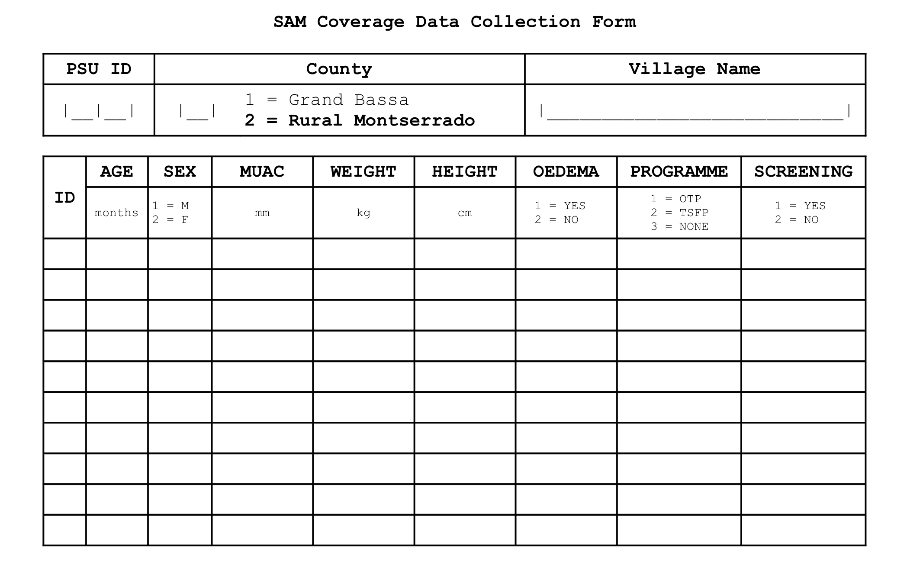
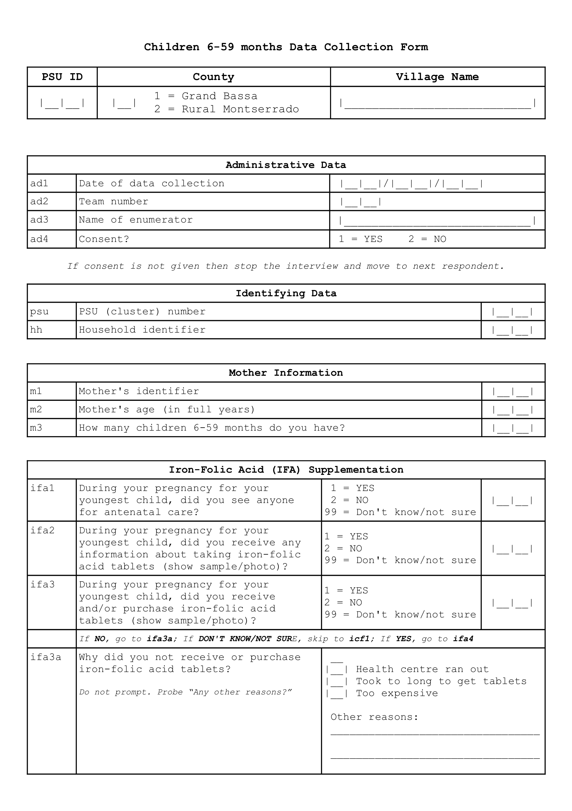
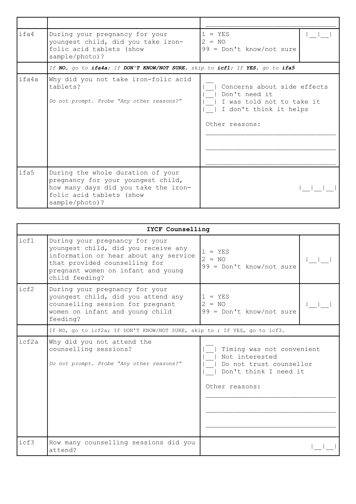
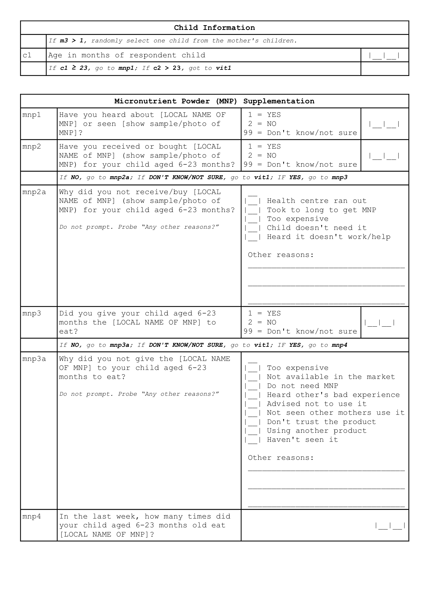
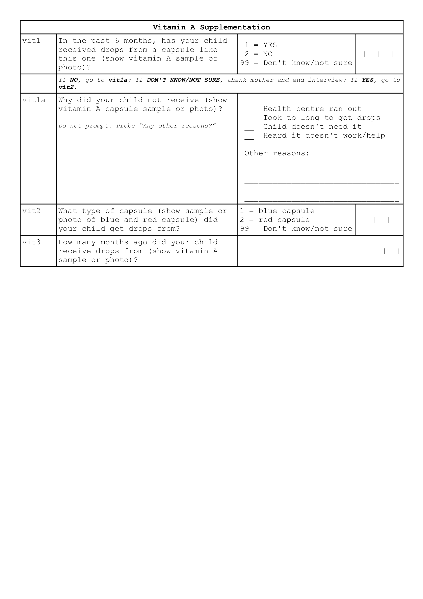

# Questionnaire {#questionnaire}

The following are sample/template questionnaires used for the two types of surveys that will be implemented.

## CMAM coverage survey instruments

CMAM coverage surveys use primarily use two forms. The first form is used to collect coverage data from SAM children found during the survey. Given that this survey will use house-to-house/door-to-door sampling for stage 2, then it would be necessary to record all data from all children that are measured with MUAC, weight-for-height and oedema. The following tabular form can be used for this purpose:

\newpage

```{r samform, echo = FALSE, fig.cap = "SAM coverage survey sample/template form", out.width = "90%", fig.align = "center", fig.pos = "H", fig.retina = 1}

```

&nbsp;

The data collected using the tabular forms will allow estimation of coverage. They do not, however, allow you to know the reasons for coverage failure. To collect this data we apply a “barriers” questionnaire to the mothers/carers of uncovered SAM cases. Here is an example of a barriers questionnaire:

\newpage

```{r sambarriers, echo = FALSE, fig.cap = "SAM coverage barriers survey sample/template form", out.width = "90%", fig.align = "center", fig.pos = "H", fig.retina = 1}
knitr::include_graphics("forms/samBarriersForm.png")
```

\newpage

## Survey for children 6-59 months and their mothers

For the survey for children 6-59 months, following is a sample/template questionnaire. 

```{r childform1, echo = FALSE, fig.cap = "Children 6-59 months old and their mothers survey sample/template form", out.width = "90%", fig.align = "center", fig.pos = "H", fig.retina = 1}




```

## Using Open Data Kit

Based on the template forms described in the previous sections, a digital data collection system using Open Data Kit (ODK) has been developed. These forms are availabe as a [Github repository](https://github.com/validmeasures/liberiaS3Mforms). The system is composed of two forms.

### Village form

This form (`liberiaCoverageVillageForm.xlsx` and `liberiaCoverageVillageForm.xml`) collects information on the villages or primary sampling units (PSU) selected for the Liberia Coverage Survey. This information includes:

1. County name (and identifier)

2. Village name (and identifier)

3. Village population size 

4. Village geocoordinates

### Coverage form

This form (`liberiaCoverage.xlsx` and `liberiaCoverage.xml`) collects information on the various coverage indicators assessed in the Liberia Coverage Survey:

1. CMAM coverage

2. Iron-folic acid supplementation coverage

3. IYCF counselling coverage

4. Micronutrient powder supplementation coverage

5. Vitamin A supplementation coverage

The coverage form has been developed in such a way that it implements the survey as per survey design such that the modules for IFA coverage, IYCF counselling coverage, MNP supplementation coverage and vitamin A supplementation coverage are only shown based on the sampling interval for a particular primary sampling unit (PSU) and based on the different eligibitlity requirements for each coverage survey module.

### Usage

For those wanting to test out the forms on their own Android mobile devices, the following applications need to be downloaded and installed from the Google Play Store:

* ODK Collect ([link](https://play.google.com/store/apps/details?id=org.odk.collect.android&hl=en_GB))

* ODK Counter ([link](https://play.google.com/store/apps/details?id=org.opendatakit.counter&hl=en_GB))

Once these applications are isntalled, there are two option for getting the Liberia Coverage Survey forms onto mobile devices.

### 1. Using ODK Aggregator or other similar ODK servers
The XLSForm can be uploaded to a remote server-based ODK Aggregator or other ODK servers such as ONA, SurveyCTO, KoBoToolbox and the like. The form is validated and then converted into XML format which can then be retrieved from the server into mobile devices as blank forms.

For the purposes of viewing and testing the Liberia Coverage Survey forms, a test server has been setup. To view and/or test the Liberia Coverage Survey forms, ODK Collect in the mobile devices will need to be connected to the server. This is described [here](https://docs.opendatakit.org/collect-connect-aggregate/). The following ODK Aggregate server setttings should be used:

&nbsp;

**url**: https://odk.ona.io

**username:** validtrial

**password:** zEF-STN-5ze-qom

&nbsp;

Once ODK Collect has been connected to the test server, it will now be possible to pull the Liberia Coverage Survey forms into ODK Collect in the mobile device using the instructions found [here](https://docs.opendatakit.org/collect-forms/).

Once the Liberia Coverage Survey forms have been pulled into the ODK Collect in the mobile device, the forms can be viewed and tested by following the instructions [here](https://docs.opendatakit.org/collect-filling-forms/).

### 2. Convert to XML and transfer to mobile devices via USB cable connection
The XML version of this form can then be transferred to the mobile devices (into the device's `odk` folder) via local USB connection. This can be done by following the instructions [here](https://docs.opendatakit.org/collect-forms/#loading-forms-directly). The associated media files for the forms (found in the folder called `media` in this repository) will also need to be transferred to the mobile device. This can be done by following the instructions [here](https://docs.opendatakit.org/collect-forms/#loading-form-media).
