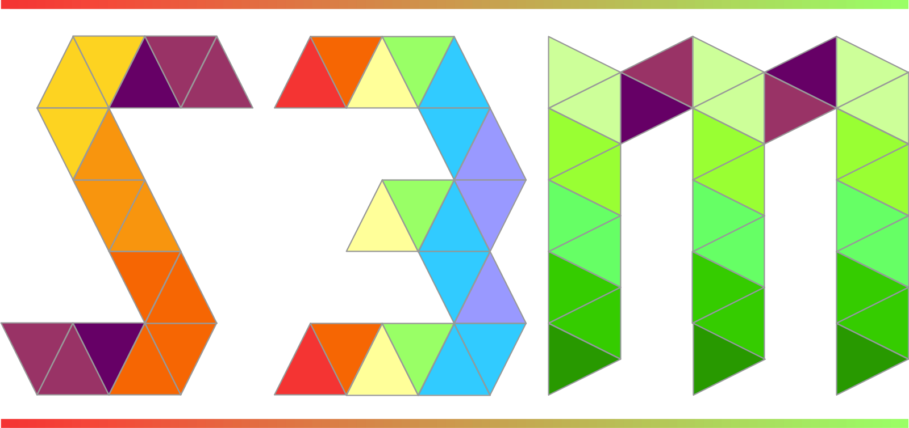

--- 
title: "Notes on a design of a simple spatial sampling method (S3M) for assessing coverage of health and nutrition programmes in Liberia"
author: "Valid International"
date: "`r Sys.Date()`"
knit: bookdown::render_book
site: bookdown::bookdown_site
documentclass: book
geometry: margin=2cm
classoption: a4paper
bibliography: ["book.bib"]
biblio-style: "apalike"
link-citations: TRUE
links-as-notes: FALSE
colorlinks: TRUE
fontsize: 12pt
url: http\://design.validmeasures.com/liberiaS3M
cover-image: figures/s3mlogo.png
description: "Notes on a design of a simple spatial sampling method (S3M) for assessing coverage of health and nutrition programmes in Liberia"
---

```{r, echo = FALSE, warning = FALSE, message = FALSE}
knitr::opts_chunk$set(
  warning = FALSE,
  message = FALSE,
  collapse = TRUE,
  comment = "#>",
  fig.path = "figures/"
)

options(stringsAsFactors = FALSE)

if(!require(devtools)) install.packages("devtools")
if(!require(rgdal)) install.packages("rgdal")
if(!require(rgeos)) install.packages("rgeos")
if(!require(raster)) install.packages("raster")
if(!require(spatialsampler)) install_github("validmeasures/spatialsampler")
if(!require(liberia)) install_github("validmeasures/liberia")
if(!require(maps)) install.packages("maps")
if(!require(knitr)) install.packages("knitr")
if(!require(kableExtra)) install.packages("kableExtra")
if(!require(magrittr)) install.packages("magrittr")
if(!require(FNN)) install.packages("FNN")

#library(devtools)
#library(rgdal)
#library(rgeos)
#library(raster)
#library(spatialsampler)
#library(liberia)
#library(maps)
#library(knitr)
#library(kableExtra)
#library(magrittr)
#library(FNN)


wca <- rgdal::readOGR(dsn = "maps/wca_adm0",
                      layer = "wca_adm0",
                      verbose = FALSE)

roads <- rgdal::readOGR(dsn = "maps/lbr_rdsl_unmil",
                        layer = "lbr_rdsl_unmil",
                        verbose = FALSE)

tracks <- subset(roads, CATEGORY %in% c("Track", "Tracks"))
primary <- subset(roads, CATEGORY == "Primary Routes")
paved <- subset(roads, CATEGORY == "Paved") 

poi <- rgdal::readOGR(dsn = "maps/hotosm_liberia_points_of_interest_points_shp",
                      layer = "hotosm_liberia_points_of_interest_points",
                      verbose = FALSE)

montserrado1 <- counties[counties$admin1name == "Montserrado", ]
montserrado2 <- districts[districts$admin1Name == "Montserrado", ]

montserradoGrid <- create_s3m_grid(input = montserrado1, 
                                   d = 6, 
                                   buffer = 6, 
                                   country = "Liberia", 
                                   output = "lines")

montserradoSP <- create_s3m_grid(input = montserrado1, 
                                 d = 6, 
                                 buffer = 6, 
                                 country = "Liberia",
                                 output = "points")

grandbassa1 <- counties[counties$admin1name == "Grand Bassa", ]
grandbassa2 <- districts[districts$admin1Name == "Grand Bassa", ]

grandbassaGrid <- create_s3m_grid(input = grandbassa1,
                                  d = 10,
                                  buffer = 6,
                                  country = "Liberia",
                                  output = "lines")

grandbassaSP <- create_s3m_grid(input = grandbassa1,
                                d = 10,
                                buffer = 6,
                                country = "Liberia",
                                output = "points")
```

# Simple Spatial Sampling Method (S3M) {-}

