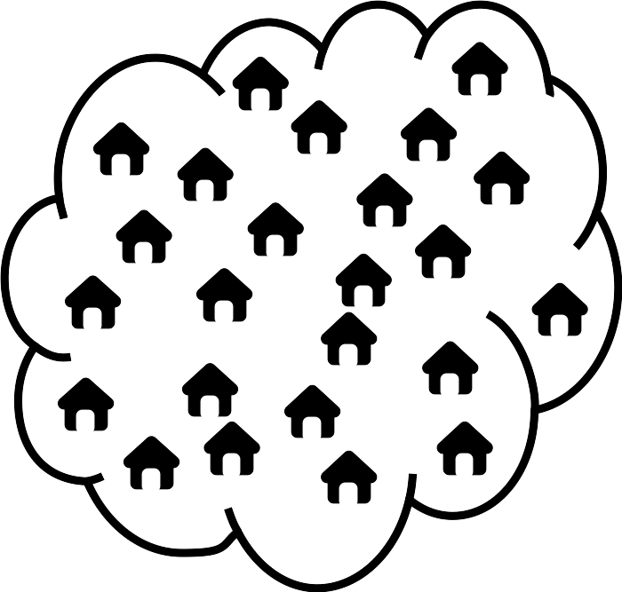
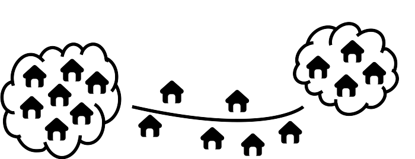

--- 
title: "Notes on a design of a simple spatial sampling method (S3M) for assessing coverage of health and nutrition programmes in Liberia"
author: "Valid International"
date: "`r Sys.Date()`"
knit: bookdown::render_book
site: bookdown::bookdown_site
documentclass: book
geometry: margin=2cm
classoption: a4paper
bibliography: ["book.bib"]
biblio-style: "apalike"
link-citations: TRUE
links-as-notes: FALSE
colorlinks: TRUE
linkcolor: blue
citecolor: blue
urlcolor: blue
fontsize: 12pt
always_allow_html: yes
url: http\://design.validmeasures.com/liberiaS3M
cover-image: figures/s3mlogo.png
description: "Notes on a design of a simple spatial sampling method (S3M) for assessing coverage of health and nutrition programmes in Liberia"
---

```{r, echo = FALSE, warning = FALSE, message = FALSE}
knitr::opts_chunk$set(
  warning = FALSE,
  message = FALSE,
  collapse = TRUE,
  comment = "#>",
  fig.path = "figures/"
)

options(stringsAsFactors = FALSE)

if(!require(devtools)) install.packages("devtools")
if(!require(rgdal)) install.packages("rgdal")
if(!require(rgeos)) install.packages("rgeos")
if(!require(raster)) install.packages("raster")
if(!require(spatialsampler)) install_github("validmeasures/spatialsampler")
if(!require(liberia)) install_github("validmeasures/liberia")
if(!require(maps)) install.packages("maps")
if(!require(knitr)) install.packages("knitr")
if(!require(kableExtra)) install.packages("kableExtra")
if(!require(magrittr)) install.packages("magrittr")
if(!require(FNN)) install.packages("FNN")

wca <- rgdal::readOGR(dsn = "maps/wca_adm0",
                      layer = "wca_adm0",
                      verbose = FALSE)

roads <- rgdal::readOGR(dsn = "maps/lbr_rdsl_unmil",
                        layer = "lbr_rdsl_unmil",
                        verbose = FALSE)

tracks <- subset(roads, CATEGORY %in% c("Track", "Tracks"))
primary <- subset(roads, CATEGORY == "Primary Routes")
paved <- subset(roads, CATEGORY == "Paved") 

poi <- rgdal::readOGR(dsn = "maps/hotosm_liberia_points_of_interest_points_shp",
                      layer = "hotosm_liberia_points_of_interest_points",
                      verbose = FALSE)

montserrado1 <- counties[counties$admin1name == "Montserrado", ]
montserrado2 <- districts[districts$admin1Name == "Montserrado", ]

montserradoGrid <- create_s3m_grid(input = montserrado1, 
                                   d = 6, 
                                   buffer = 6, 
                                   country = "Liberia", 
                                   output = "lines")

montserradoSP <- create_s3m_grid(input = montserrado1, 
                                 d = 6, 
                                 buffer = 6, 
                                 country = "Liberia",
                                 output = "points")

grandbassa1 <- counties[counties$admin1name == "Grand Bassa", ]
grandbassa2 <- districts[districts$admin1Name == "Grand Bassa", ]

grandbassaGrid <- create_s3m_grid(input = grandbassa1,
                                  d = 10,
                                  buffer = 6,
                                  country = "Liberia",
                                  output = "lines")

grandbassaSP <- create_s3m_grid(input = grandbassa1,
                                d = 10,
                                buffer = 6,
                                country = "Liberia",
                                output = "points")
```

# Simple Spatial Sampling Method (S3M) {-}


<!--chapter:end:index.Rmd-->

# Introduction {#introduction}

The Simple Spatial Survey Method (S3M) was developed from the CSAS coverage survey method as a response to the widespread adoption of community management of acute malnutrition (CMAM) by ministries of health. Large-scale programs need a large-scale survey method and S3M was developed to meet that need.

S3M was designed to :

* Be simple enough for MoH, NGO, and UNO personnel without specialist statistical training to perform.

* Provide a general survey method. S3M can be used to survey and map :

    * Need for and coverage of selective-entry programs such as CMAM and TSFP as well as universal programs such as EPI, GMP, GFD (general ration), and “blanket” SFP over wide areas.

    * Levels of indicators such as those for IYCF, WASH, and period prevalence / cumulative prevalence of ARI, fever, and diarrhoea over wide areas.

This document concentrates on using S3M to assess the need for and coverage of:

* Treatment of SAM in children aged between 6 and 59 months;

* Vitamin A supplementation;

* Micronutrient powder supplementation;

* Ferrous sulfate-folic acid supplementation; and,

* Infant and young child feeding counselling.

<!--chapter:end:01-introduction.Rmd-->

# The survey sample {#sample}

The survey method described here uses a two-stage sample:

* **First-stage:** We take an even (or near-even) spatial sample of communities from all of the communities in the survey area.

* **Second-stage:** We take a sample of eligible individuals from each of the communities identified in the first stage of sampling.

Two-stage sampling is used in many survey methods. A typical example of a survey method that uses a two-stage sample is the SMART method that is commonly used for nutritional anthropometry surveys.

The main difference between the sample taken in S3M based surveys and in SMART type surveys is that S3M based samples use a spatial sample in the first stage whereas SMART type surveys use a proportional to population size (PPS) sample.

The advantages of using a spatial first stage sample is that such a sample allows us to identify where (and why) coverage is good, and where (and why) coverage is poor. This information is essential to improving program coverage and ensuring equitable access to services.

A spatial sample can be used to produce equivalent results to a traditional proportional to population size (PPS) sample as is used in (e.g.) SMART type surveys using a weighted analysis. This means that a spatial sample can be made to act as a PPS sample. A PPS type sample cannot, however, be made to act as a spatial sample.

## The first stage sample {#stage1}

### Step 1: Find a map

The first step in a S3M survey is to find a map of the survey area. A map showing the locations of all towns and villages in the survey area is essential. Try to find a map showing the locations of all towns and villages in the survey area. You may need to update the map to take into account migration and displacement.

For the coverage survey of 2 counties in Liberia, it will be practical and useful to have:

* A small scale-map (a wide area map but with poor detail) of the entire survey area for each of the 2 counties. If the counties are contiguous (i.e., share borders with each other), the small scale map can be of the two counties together. This map does not need to show the location of all towns and villages in the survey area but it gives a general idea of where the 2 counties are located and main towns and locations and roads. Figure \@ref(fig:smallScaleMap) is a small scale map of Liberia showing counties, roads and main towns and locations. Figure \@ref(fig:smallScaleMapCounty) is a small scale map of two counties showing all the districts within the county, roads and main towns and locations.

\newpage

```{r smallScaleMap, echo = FALSE, eval = TRUE, fig.cap = "Small scale map of Liberia showing counties, roads and points of interest", fig.align = "center", fig.width = 10, fig.height = 10, fig.pos = "H", fig.retina = 1}
# Set margins
par(mar = c(0, 0, 0, 0))
# Plot map
plot(liberia::counties, lwd = 2, border = "gray50")
plot(wca, lwd = 4, border = "black", add = TRUE)
plot(primary, lwd = 1, lty = 2, col = "blue", add = TRUE)
plot(paved, lwd = 3, lty = 1, col = "blue", add = TRUE)
plot(poi, pch = 4, cex = 0.3, lwd = 1, col = "darkgreen", add = TRUE)
map.scale()
legend(x = "topright",
       inset = 0.02,
       y.intersp = 1.2,
       bg = "white",
       legend = c("Country borders", "County borders", "Paved roads", 
                  "Primary roads", "Main towns and locations"),
       pch = c(0, 0, NA, NA, 4),
       lty = c(NA, NA, 1, 2, NA),
       lwd = c(3, 2, 2, 1, 2),
       col = c("black", "gray50", "blue", "blue", "darkgreen"),
       cex = 1,
       pt.cex = 2)
```

\newpage

```{r smallScaleMapCounty, echo = FALSE, eval = TRUE, fig.cap = "Small scale map of Montserrado and Grand Bassa in Liberia showing all districts, roads and points of interest", fig.align = "center", fig.width = 6, fig.height = 12, fig.pos = "H", fig.retina = 1}
# Set margins and plot layout
par(mar = c(1, 1, 1, 1), mfrow = c(2, 1))
# Draw first county
plot(subset(districts, admin1Name == "Grand Bassa"), 
     lwd = 1, 
     border = "gray50")
plot(counties, lwd = 1, border = "black", add = TRUE)
plot(wca, lwd = 4, border = "black", add = TRUE)
text(x = counties, 
     labels = counties$admin1name, 
     cex = 2, col = "gray70")
plot(primary, lwd = 1, lty = 2, col = "blue", add = TRUE)
plot(paved, lwd = 3, lty = 1, col = "blue", add = TRUE)
plot(poi, pch = 4, cex = 0.3, lwd = 1, col = "darkgreen", add = TRUE)
map.scale(ratio = FALSE)
# Draw second county
plot(subset(districts, admin1Name == "Montserrado"), 
     lwd = 2, 
     border = "gray50")
plot(counties, lwd = 1, border = "black", add = TRUE)
plot(wca, lwd = 4, border = "black", add = TRUE)
text(x = counties, 
     labels = counties$admin1name, 
     cex = 2, col = "gray70")
plot(primary, lwd = 1, lty = 2, col = "blue", add = TRUE)
plot(paved, lwd = 3, lty = 1, col = "blue", add = TRUE)
plot(poi, pch = 4, cex = 0.3, lwd = 1, col = "darkgreen", add = TRUE)
map.scale(ratio = FALSE)
```

\newpage

* A collection of larger scale maps (a small area map but with good detail) of each of the selected counties and each of the districts within those counties in Liberia. Figure \@ref(fig:largeScaleMapCounty1) is a large scale map of Montserrado county showing all districts, roads and all settlements. Figure \@ref(fig:largeScaleMapDistricts1) is a collection of large scale maps of each of the districts of Montserrado country showing all roads and all settlements.

&nbsp;

```{r largeScaleMapCounty1, echo = FALSE, eval = TRUE, fig.cap = "Large scale map of Montserrado county in Liberia showing all districts, roads and all settlements (towns, villages)", fig.align = "center", fig.width = 10, fig.height = 10, fig.pos = "H", fig.retina = 1}
par(mar = c(0, 0, 0, 0))
plot(subset(liberia::districts, admin1Name == "Montserrado"), lwd = 1, border = "gray50")
plot(liberia::counties, lwd = 4, border = "black", add = TRUE)
plot(wca, lwd = 5, border = "black", add = TRUE)
text(x = subset(counties, admin1name == "Montserrado"), 
     labels = subset(counties, admin1name == "Montserrado")$admin1name, 
     cex = 4, col = "gray70")
raster::text(x = subset(districts, admin1Name == "Montserrado"), 
             labels = subset(districts, admin1Name == "Montserrado")$admin2Name, 
             cex = 1, col = "gray70")
plot(primary, lwd = 2, lty = 2, col = "blue", add = TRUE)
plot(paved, lwd = 2, lty = 1, col = "blue", add = TRUE)
plot(settlements, pch = 4, cex = 0.5, lwd = 1, col = "darkgreen", add = TRUE)
map.scale(ratio = FALSE)
legend(x = "topleft",
       inset = 0.02,
       y.intersp = 1.2,
       bg = "white",
       legend = c("Country borders", "County borders", "Paved roads", 
                  "Primary roads", "All settlements"),
       pch = c(0, 0, NA, NA, 4),
       lty = c(NA, NA, 1, 2, NA),
       lwd = c(3, 2, 2, 1, 2),
       col = c("black", "gray50", "blue", "blue", "darkgreen"),
       cex = 1,
       pt.cex = 2)
```

\newpage

```{r largeScaleMapDistricts1, echo = FALSE, eval = TRUE, fig.cap = "Large scale maps of 5 districts of Montserrado county in Liberia showing roads and all settlements (towns, villages)", fig.align = "center", fig.width = 10, fig.height = 15, fig.pos = "H", fig.retina = 1}
# Set margins and plot layout
par(mar = c(1, 1, 1, 1), mfrow = c(3, 2))
# Plot maps
for(i in subset(districts, admin1Name == "Montserrado")$admin2Name) {
  plot(subset(districts, admin1Name == "Montserrado" & admin2Name == i), 
       lwd = 1, 
       border = "black")
  plot(counties, lwd = 2, border = "black", add = TRUE)
  #sp::plot(wca, lwd = 4, border = "black", add = TRUE)
  text(x = subset(districts, admin1Name == "Montserrado" & admin2Name == i), 
       labels = i, 
       cex = 3, 
       col = "gray70")
  plot(primary, lwd = 1, lty = 2, col = "blue", add = TRUE)
  plot(paved, lwd = 3, lty = 1, col = "blue", add = TRUE)
  plot(settlements, pch = 4, cex = 0.3, lwd = 1, col = "darkgreen", add = TRUE)
  map.scale(ratio = FALSE)
}
```

\newpage

```{r largeScaleMapCounty2, echo = FALSE, eval = TRUE, fig.cap = "Large scale map of Grand Bassa county in Liberia showing all districts, roads and all settlements (towns, villages)", fig.align = "center", fig.width = 10, fig.height = 10, fig.pos = "H", fig.retina = 1}
par(mar = c(0, 0, 0, 0))
plot(grandbassa2, lwd = 1, border = "gray50")
plot(liberia::counties, lwd = 4, border = "black", add = TRUE)
plot(wca, lwd = 5, border = "black", add = TRUE)
text(x = grandbassa1, 
     labels = grandbassa1$admin1name, 
     cex = 4, col = "gray70")
raster::text(x = grandbassa2, 
             labels = grandbassa2$admin2Name, 
             cex = 1, col = "gray70")
plot(primary, lwd = 2, lty = 2, col = "blue", add = TRUE)
plot(paved, lwd = 2, lty = 1, col = "blue", add = TRUE)
plot(settlements, pch = 4, cex = 0.5, lwd = 1, col = "darkgreen", add = TRUE)
map.scale(ratio = FALSE)
legend(x = "topleft",
       inset = 0.02,
       y.intersp = 1.2,
       bg = "white",
       legend = c("Country borders", "County borders", "Paved roads", 
                  "Primary roads", "All settlements"),
       pch = c(0, 0, NA, NA, 4),
       lty = c(NA, NA, 1, 2, NA),
       lwd = c(3, 2, 2, 1, 2),
       col = c("black", "gray50", "blue", "blue", "darkgreen"),
       cex = 1,
       pt.cex = 2)
```

\newpage

```{r largeScaleMapDistricts2, echo = FALSE, eval = TRUE, fig.cap = "Large scale maps of 8 districts of Grand Bassa county in Liberia showing roads and all settlements (towns, villages)", fig.align = "center", fig.width = 10, fig.height = 15, fig.pos = "H", fig.retina = 1}
# Set margins and plot layout
par(mar = c(1, 1, 1, 1), mfrow = c(2, 2))
# Plot maps
for(i in grandbassa2$admin2Name[1:4]) {
  plot(subset(grandbassa2, admin2Name == i), 
       lwd = 1, 
       border = "black")
  plot(counties, lwd = 2, border = "black", add = TRUE)
  #sp::plot(wca, lwd = 4, border = "black", add = TRUE)
  text(x = subset(grandbassa2, admin2Name == i), 
       labels = i, 
       cex = 3, 
       col = "gray70")
  plot(primary, lwd = 1, lty = 2, col = "blue", add = TRUE)
  plot(paved, lwd = 3, lty = 1, col = "blue", add = TRUE)
  plot(settlements, pch = 4, cex = 0.3, lwd = 1, col = "darkgreen", add = TRUE)
  map.scale(ratio = FALSE)
}
```

\newpage

```{r largeScaleMapDistricts3, echo = FALSE, eval = TRUE, fig.cap = "Large scale maps of 8 districts of Grand Bassa county in Liberia showing roads and all settlements (towns, villages) continued", fig.align = "center", fig.width = 10, fig.height = 15, fig.pos = "H", fig.retina = 1}
# Set margins and plot layout
par(mar = c(1, 1, 1, 1), mfrow = c(2, 2))
# Plot maps
for(i in grandbassa2$admin2Name[5:8]) {
  plot(subset(grandbassa2, admin2Name == i), 
       lwd = 1, 
       border = "black")
  plot(counties, lwd = 2, border = "black", add = TRUE)
  #sp::plot(wca, lwd = 4, border = "black", add = TRUE)
  text(x = subset(grandbassa2, admin2Name == i), 
       labels = i, 
       cex = 3, 
       col = "gray70")
  plot(primary, lwd = 1, lty = 2, col = "blue", add = TRUE)
  plot(paved, lwd = 3, lty = 1, col = "blue", add = TRUE)
  plot(settlements, pch = 4, cex = 0.3, lwd = 1, col = "darkgreen", add = TRUE)
  map.scale(ratio = FALSE)
}
```

\newpage

The small-scale maps in Figures \@ref(fig:smallScaleMap) and \@ref(fig:smallScaleMapCounty) will be useful for identifying initial sampling locations. 

The large-scale maps in Figures \@ref(fig:largeScaleMapCounty1), \@ref(fig:largeScaleMapCounty2), \@ref(fig:largeScaleMapDistricts1), \@ref(fig:largeScaleMapDistricts2) and \@ref(fig:largeScaleMapDistricts3) will be useful for identifying the precise location of sampling points and for selecting the communities to be sampled.

\newpage

### Step 2: Decide the area to represent each sampling point

The easiest way of thinking about this is as a function of the intended maximum distance ($d$) of any community from the nearest sampling point (see Figure \@ref(fig:distance1).

&nbsp;

```{r distance1, echo = FALSE, eval = TRUE, fig.cap = "Conceptual presentation of the area represented by each sampling point", fig.align = "center", fig.pos = "H", fig.retina = 1}
knitr::include_graphics("figures/step2.png")
```

&nbsp;

There are other ways of thinking about $d$. These are:

1. **The area of each triangular tile**: This can be calculated using the formula:

$$ A ~ = ~ \tan30^ \circ ~ \times ~ \frac{9}{4} ~ d ^ 2 $$

For $d ~ = ~ 10 ~ \text{km}$ the area of each triangular tile will be about:

$$ A ~ = ~ \tan30^ \circ ~ \times ~ \frac{9}{4} ~ d ^ 2 ~ \approx ~ 1.3 ~ \times ~ 100 ~ = ~ 130 ~ \text{km} ^ 2 $$

2. **Practicability**: Most of the time spent in the field when doing a survey will be in travelling to and from sampling points. Having many sampling points can make for an expensive and / or lengthy survey. If you know how many sampling points that you can afford to take ($m$) then you can make a **very approximate** estimate of a suitable value for d using the following *rule-of-thumb* formula:

$$ d ~ \approx ~ \sqrt{\frac{\text{Program Area}}{m}} $$

The value of $d$ calculated using this formula is approximate and should be used as a starting point for a number of trial samples using the procedure outlined below.

&nbsp;

+----------+---------------+----------+---------------+
| **Pair** | **Distance**  | **Pair** | **Distance**  |
+:========:+:=============:+:========:+:=============:+
| 1        | 21 km         | 13       | 13 km         |
+----------+---------------+----------+---------------+
| 2        | 14 km         | 14       | 11 km         |
+----------+---------------+----------+---------------+
| 3        | 13 km         | 15       | 12 km         |
+----------+---------------+----------+---------------+
| 4        | 17 km         | 16       | 15 km         |
+----------+---------------+----------+---------------+
| 5        | 11 km         | 17       | 13 km         |
+----------+---------------+----------+---------------+
| 6        | 14 km         | 18       | 16 km         |
+----------+---------------+----------+---------------+
| 7        | 12 km         | 19       | 18 km         |
+----------+---------------+----------+---------------+
| 8        | 15 km         | 20       | 13 km         |
+----------+---------------+----------+---------------+
| 9        | 16 km         | 21       | 8 km          |
+----------+---------------+----------+---------------+
| 10       | 12 km         | 22       | 16 km         |
+----------+---------------+----------+---------------+
| 11       | 17 km         | 23       | 18 km         |
+----------+---------------+----------+---------------+
| 12       | 14 km         | 24       | 14 km         |
+----------+---------------+----------+---------------+

&nbsp;

```{r distance2, echo = FALSE, eval = TRUE, fig.cap = "Distances of communities to the nearest substantial markets", fig.align = "center", fig.pos = "H", fig.retina = 1}
include_graphics("figures/step2a.png")
```

&nbsp;

```{block2, type = "rmdcalc"}
Following are steps to estimate value of $d$ based on distances that carers are willing or able to walk to access services.

&nbsp;

Using the information from the distance table, add the distances together: 
  
$$ \sum \text{Distance} ~ = ~ 343 ~ \text{km} $$

&nbsp;
  
Divide the result by the number of paired distances:
  
$$ \frac{\sum \text{Distance}}{\text{Number of paired distances}} ~ = ~ \frac{343}{24} ~ = ~ 14.29 ~ \text{km} $$

&nbsp;
  
Divide the result by two:
  
$$ d ~ = ~ \frac{14.29}{2} ~ = ~ 7.15 ~ \approx ~ 7 ~ \text{km} $$
```
  
&nbsp;
  
This is an estimate of the distance that carers are willing or able to walk to access services. Only distances between towns and villages with markets are used in this calculation.

A way of deciding a value for $d$ that is based on the economic geography of the survey area is to set $d$ to one half of the mean distance between neighbouring pairs of communities with substantial markets.

S3M surveys have been done using a wide range (i.e. from $d ~ = ~ 8 ~ \text{km}$ to $d ~ = ~ 33 ~ \text{km}$) of values for $d$. A value for $d$ of 10 km or 12 km will probably be small enough in most circumstances.

\newpage

### Step 3: Draw a grid over the map

```{r grid1, echo = FALSE, eval = TRUE, fig.cap = "Montserrado county with a rectangular grid defined by d of 6 km", fig.align = "center", fig.width = 8, fig.height = 8, fig.pos = "H", fig.retina = 1}
par(mar = c(0, 0, 0, 0))
plot(montserradoGrid, lty = 0)
plot(counties, add = TRUE)
plot(montserrado1, lwd = 3, add = TRUE)
plot(primary, lwd = 2, lty = 2, col = "blue", add = TRUE)
plot(paved, lwd = 2, lty = 1, col = "blue", add = TRUE)
plot(settlements, pch = 4, cex = 0.5, lwd = 1, col = "darkgreen", add = TRUE)
plot(montserradoGrid, add = TRUE)
legend(x = "topleft",
       inset = 0.02,
       y.intersp = 1.2,
       bg = "white",
       legend = c("County borders", "Montserrado borders", "Paved roads", 
                  "Primary roads", "All settlements"),
       pch = c(0, 0, NA, NA, 4),
       lty = c(NA, NA, 1, 2, NA),
       lwd = c(1, 3, 2, 2, 2),
       col = c("black", "black", "blue", "blue", "darkgreen"),
       cex = 1,
       pt.cex = 2)
map.scale()
```

\newpage

```{r grid1a, echo = FALSE, eval = TRUE, fig.cap = "Grand Bassa county with a rectangular grid defined by d of 10 km", fig.align = "center", fig.width = 8, fig.height = 8, fig.pos = "H", fig.retina = 1}
par(mar = c(0, 0, 0, 0))
plot(grandbassaGrid, lty = 0)
plot(counties, add = TRUE)
plot(grandbassa1, lwd = 3, add = TRUE)
plot(primary, lwd = 2, lty = 2, col = "blue", add = TRUE)
plot(paved, lwd = 2, lty = 1, col = "blue", add = TRUE)
plot(settlements, pch = 4, cex = 0.5, lwd = 1, col = "darkgreen", add = TRUE)
plot(grandbassaGrid, add = TRUE)
legend(x = "topleft",
       inset = 0.02,
       y.intersp = 1.2,
       bg = "white",
       legend = c("County borders", "Grand Bassa borders", "Paved roads", 
                  "Primary roads", "All settlements"),
       pch = c(0, 0, NA, NA, 4),
       lty = c(NA, NA, 1, 2, NA),
       lwd = c(1, 3, 2, 2, 2),
       col = c("black", "black", "blue", "blue", "darkgreen"),
       cex = 1,
       pt.cex = 2)
map.scale()
```

&nbsp;

The next step is to draw a grid over the map.

The size of the grid is determined by the distance ($d$) that you decided in **Step 2**.

The grid is rectangular rather than square. This allows us to place sampling points at the centres of hexagons in a hexagonal grid without the need to draw a hexagonal grid (see **Step 4**).

The width of the grid in the east-west ($x$) direction is different from the height of the grid in the north-south ($y$) direction.

The width of the grid in the east-west ($x$) direction is calculated using:

$$ x ~ = ~ \frac{3d}{2} $$

where $d$ is the distance ($d$) that you decided in **Step 2**.

The height of the grid in the north-south ($y$) direction can be calculated using:

$$ y ~ = ~ \frac{\sqrt{3}d}{2} $$

where $d$ is the distance ($d$) that you decided in **Step 2**.

For example, in Figure \@ref(fig:grid1), we used $d ~ = ~ 6 ~ \text{km}$. This value of $d$ creates a rectangular grid with the following dimensions:

$$ x ~ = ~ \frac{3d}{2} ~ = ~ \frac{3 ~ \times ~ 6}{2} ~ = ~ \frac{18}{2} ~ = ~ 9 ~ \text{km} $$

and:

$$ y ~ = ~ \frac{\sqrt{3}d}{2} ~ \approx ~ \frac{1.73 ~ \times ~ 6}{2} ~ \approx ~ \frac{10.38}{2} ~ \approx ~ 5.2 ~ \text{km} $$

So, the grid in Figure \@ref(fig:grid1) is 9 km long on the east-west direction and 5.2 km on the north and south direction.

\newpage

The table below shows the grid sizes for different values of $d$:

+--------+------------+------------+-----+--------+------------+------------+
| **d**  | **x**      | **y**      |     | **d**  | **x**      | **y**      |
+=======:+===========:+===========:+=====+=======:+===========:+===========:+
| 5      | 7.5        | 4.3        |     | 13     | 19.5       | 11.3       |
+--------+------------+------------+-----+--------+------------+------------+
| 6      | 9.0        | 5.2        |     | 14     | 21.0       | 12.1       |
+--------+------------+------------+-----+--------+------------+------------+
| 7      | 10.5       | 6.1        |     | 15     | 22.5       | 13.0       |
+--------+------------+------------+-----+--------+------------+------------+
| 8      | 12.0       | 6.9        |     | 16     | 24.0       | 13.9       |
+--------+------------+------------+-----+--------+------------+------------+
| 9      | 13,5       | 7.8        |     | 17     | 25.5       | 14.7       |
+--------+------------+------------+-----+--------+------------+------------+
| 10     | 15.0       | 8.7        |     | 18     | 27.0       | 15.6       |
+--------+------------+------------+-----+--------+------------+------------+
| 11     | 16.5       | 19.5       |     | 19     | 28.5       | 16.5       |
+--------+------------+------------+-----+--------+------------+------------+
| 12     | 18.0       | 10.4       |     | 20     | 30.0       | 17.3       |
+--------+------------+------------+-----+--------+------------+------------+

When drawing the grid make sure that it covers the entire survey area.

It is usually best to draw a grid that covers an area that is a little larger than the entire survey area. This helps to ensure that the survey will sample from the entire survey area.

The grid can be drawn using marker pens onto plastic film overlaying the map. This protects the map and allows you to reposition the grid to improve the coverage of the sample should this be needed.

If you are drawing the grid directly onto the map then use a soft pencil (e.g. a *2B* or *#1* pencil). A soft pencil will not damage the surface of the map and is easy to erase using a soft rubber eraser should you make a mistake or need to draw a different grid.

\newpage

### Step 4: Create an even spread of sampling points

```{r grid2, echo = FALSE, eval = TRUE, fig.cap = "Montserrado county with a rectangular grid defined by d of 6 km and alternating intersections of the grid used to identify sampling points", fig.align = "center", fig.width = 8, fig.height = 8, fig.pos = "H", fig.retina = 1}
par(mar = c(0, 0, 0, 0))
plot(montserradoGrid, lty = 0)
plot(counties, add = TRUE)
plot(montserrado1, lwd = 3, add = TRUE)
plot(primary, lwd = 2, lty = 2, col = "blue", add = TRUE)
plot(paved, lwd = 2, lty = 1, col = "blue", add = TRUE)
plot(settlements, pch = 4, cex = 0.5, lwd = 1, col = "darkgreen", add = TRUE)
plot(montserradoGrid, add = TRUE)
plot(montserradoSP, pch = 1, cex = 2, col = "red", add = TRUE)
legend(x = "topleft",
       inset = 0.02,
       y.intersp = 1.2,
       bg = "white",
       legend = c("County borders", "Montserrado borders", "Paved roads", 
                  "Primary roads", "All settlements", "Sampling points"),
       pch = c(0, 0, NA, NA, 4, 1),
       lty = c(NA, NA, 1, 2, NA, NA),
       lwd = c(1, 3, 2, 2, 2, 2),
       col = c("black", "black", "blue", "blue", "darkgreen", "red"),
       cex = 1,
       pt.cex = 2)
map.scale()
```

\newpage

```{r grid2a, echo = FALSE, eval = TRUE, fig.cap = "Grand Bassa county with a rectangular grid defined by d of 10 km and alternating intersections of the grid used to identify sampling points", fig.align = "center", fig.width = 8, fig.height = 8, fig.pos = "H", fig.retina = 1}
par(mar = c(0, 0, 0, 0))
plot(grandbassaGrid, lty = 0)
plot(counties, add = TRUE)
plot(grandbassa1, lwd = 3, add = TRUE)
plot(primary, lwd = 2, lty = 2, col = "blue", add = TRUE)
plot(paved, lwd = 2, lty = 1, col = "blue", add = TRUE)
plot(settlements, pch = 4, cex = 0.5, lwd = 1, col = "darkgreen", add = TRUE)
plot(grandbassaGrid, add = TRUE)
plot(grandbassaSP, pch = 1, cex = 2, col = "red", add = TRUE)
legend(x = "bottomright",
       inset = 0.02,
       y.intersp = 1.2,
       bg = "white",
       legend = c("County borders", "Grand Bassa borders", "Paved roads", 
                  "Primary roads", "All settlements", "Sampling points"),
       pch = c(0, 0, NA, NA, 4, 1),
       lty = c(NA, NA, 1, 2, NA, NA),
       lwd = c(1, 3, 2, 2, 2, 2),
       col = c("black", "black", "blue", "blue", "darkgreen", "red"),
       cex = 1,
       pt.cex = 2)
map.scale()
```

Sampling points are located at the intersections of the rectangular grid in a staggered fashion. Alternate intersections of the grid in the x (east-west) and y (north-south) directions are used:

\newpage

```{r grid2b, echo = FALSE, eval = TRUE, fig.cap = "Selecting alternating intersections of the grid in the x and y directions to spread sampling points evenly", fig.align = "center", fig.pos = "H", fig.retina = 1}
include_graphics("figures/grid2a.png")
```

Note how this process places sampling points at the centres of hexagons in a hexagonal grid without the need to draw a hexagonal grid.

Make sure that your sample points go right to the edge (or even over the edge) of the survey area. This helps to ensure that the survey will sample from the entire survey area.

\newpage

### Step 5: Select the communities to sample

```{r grid3, echo = FALSE, eval = TRUE, fig.cap = "Montserrado county with a rectangular grid defined by d of 6 km and sampling points moved to the nearest communities", fig.align = "center", fig.width = 8, fig.height = 8, fig.pos = "H", fig.retina = 1}

xx <- get_nearest_point(data = settlements[settlements$admin1Name == "Montserrado", ], 
                        data.x = "COORD_X", 
                        data.y = "COORD_Y", 
                        query = montserradoSP)

par(mar = c(0, 0, 0, 0))
plot(montserradoGrid, lty = 0)
plot(counties, add = TRUE)
plot(montserrado1, lwd = 3, add = TRUE)
plot(primary, lwd = 2, lty = 2, col = "blue", add = TRUE)
plot(paved, lwd = 2, lty = 1, col = "blue", add = TRUE)
plot(settlements, pch = 4, cex = 0.5, lwd = 1, col = "darkgreen", add = TRUE)
plot(montserradoGrid, add = TRUE)
points(xx[ , c("COORD_X", "COORD_Y")], pch = 1, cex = 2, col = "red")
legend(x = "topleft",
       inset = 0.02,
       y.intersp = 1.2,
       bg = "white",
       legend = c("County borders", "Montserrado borders", "Paved roads", 
                  "Primary roads", "All settlements", "Sampling points"),
       pch = c(0, 0, NA, NA, 4, 1),
       lty = c(NA, NA, 1, 2, NA, NA),
       lwd = c(1, 3, 2, 2, 2, 2),
       col = c("black", "black", "blue", "blue", "darkgreen", "red"),
       cex = 1,
       pt.cex = 2)
map.scale()
```

\newpage

```{r grid4, echo = FALSE, eval = TRUE, fig.cap = "Grand Bassa county with a rectangular grid defined by d of 10 km and sampling points moved to the nearest communities", fig.align = "center", fig.width = 8, fig.height = 8, fig.pos = "H", fig.retina = 1}

yy <- get_nearest_point(data = settlements[settlements$admin1Name == "Grand Bassa", ], 
                        data.x = "COORD_X", 
                        data.y = "COORD_Y", 
                        query = grandbassaSP)

par(mar = c(0, 0, 0, 0))
plot(grandbassaGrid, lty = 0)
plot(counties, add = TRUE)
plot(grandbassa1, lwd = 3, add = TRUE)
plot(primary, lwd = 2, lty = 2, col = "blue", add = TRUE)
plot(paved, lwd = 2, lty = 1, col = "blue", add = TRUE)
plot(settlements, pch = 4, cex = 0.5, lwd = 1, col = "darkgreen", add = TRUE)
plot(grandbassaGrid, add = TRUE)
points(yy[ , c("COORD_X", "COORD_Y")], pch = 1, cex = 2, col = "red")
legend(x = "bottomright",
       inset = 0.02,
       y.intersp = 1.2,
       bg = "white",
       legend = c("County borders", "Grand Bassa borders", "Paved roads", 
                  "Primary roads", "All settlements", "Sampling points"),
       pch = c(0, 0, NA, NA, 4, 1),
       lty = c(NA, NA, 1, 2, NA, NA),
       lwd = c(1, 3, 2, 2, 2, 2),
       col = c("black", "black", "blue", "blue", "darkgreen", "red"),
       cex = 1,
       pt.cex = 2)
map.scale()
```

Select the community (or communities) closest to the sampling points identified in **Step 4**.

The position of the sampling point is moved to the position of the selected community. This is shown in the
diagram above.

You may drop sampling points if you find that many sampling points are clustered closely together.

You may move or add sampling points if you find that there are populated areas that do not contain sampling points.

The aim is to create a roughly even spread of sampling points over the entire survey area.

```{block2, type = "rmdcaution"}
The S3M sample is defined using a systematic sampling method. Like any systematic sampling method, an S3M sample can produce biased estimates if there is periodic variation in prevalence and / or coverage and the sampling points tend to coincide with this periodicity. This is difficult to control for without prior knowledge of the periodic variation, although simple checks such as ensuring that sampling points are not all in valleys or all on hilltops, and adjusting the grid position accordingly, should help to minimise this problem.
```

```{r grid3a, echo = FALSE, eval = TRUE, fig.cap = "Montserrado county with a rectangular grid defined by d of 6 km and sampling points moved to the nearest communities showing test triangulation", fig.align = "center", fig.width = 8, fig.height = 8, fig.pos = "H", fig.retina = 1}

triSP <- get_tri(input = xx, x = "COORD_X", y = "COORD_Y", qTSL = 0.9)

par(mar = c(0, 0, 0, 0))
plot(montserradoGrid, lty = 0)
plot(counties, add = TRUE)
plot(montserrado1, lwd = 3, add = TRUE)
plot(primary, lwd = 2, lty = 2, col = "blue", add = TRUE)
plot(paved, lwd = 2, lty = 1, col = "blue", add = TRUE)
plot(settlements, pch = 4, cex = 0.5, lwd = 1, col = "darkgreen", add = TRUE)
plot(montserradoGrid, add = TRUE)
points(xx[ , c("COORD_X", "COORD_Y")], pch = 1, cex = 2, col = "red")
plot(triSP, border = "red", lwd = 2, add = TRUE)
text(xx[ , c("COORD_X", "COORD_Y")], labels = 1:nrow(xx))
legend(x = "topleft",
       inset = 0.02,
       y.intersp = 1.2,
       bg = "white",
       legend = c("County borders", "Montserrado borders", "Paved roads", 
                  "Primary roads", "All settlements", "Sampling points"),
       pch = c(0, 0, NA, NA, 4, 1),
       lty = c(NA, NA, 1, 2, NA, NA),
       lwd = c(1, 3, 2, 2, 2, 2),
       col = c("black", "black", "blue", "blue", "darkgreen", "red"),
       cex = 1,
       pt.cex = 2)
map.scale()
```

```{r grid4a, echo = FALSE, eval = TRUE, fig.cap = "Grand Bassa county with a rectangular grid defined by d of 10 km and sampling points moved to the nearest communities showing test triangulation", fig.align = "center", fig.width = 8, fig.height = 8, fig.pos = "H", fig.retina = 1}

triSP <- get_tri(input = yy, x = "COORD_X", y = "COORD_Y", qTSL = 0.9)

par(mar = c(0, 0, 0, 0))
plot(grandbassaGrid, lty = 0)
plot(counties, add = TRUE)
plot(grandbassa1, lwd = 3, add = TRUE)
plot(primary, lwd = 2, lty = 2, col = "blue", add = TRUE)
plot(paved, lwd = 2, lty = 1, col = "blue", add = TRUE)
plot(settlements, pch = 4, cex = 0.5, lwd = 1, col = "darkgreen", add = TRUE)
plot(grandbassaGrid, add = TRUE)
points(yy[ , c("COORD_X", "COORD_Y")], pch = 1, cex = 2, col = "red")
plot(triSP, border = "red", lwd = 2, add = TRUE)
text(yy[ , c("COORD_X", "COORD_Y")], labels = 1:nrow(yy))
legend(x = "bottomright",
       inset = 0.02,
       y.intersp = 1.2,
       bg = "white",
       legend = c("County borders", "Grand Bassa borders", "Paved roads", 
                  "Primary roads", "All settlements", "Sampling points"),
       pch = c(0, 0, NA, NA, 4, 1),
       lty = c(NA, NA, 1, 2, NA, NA),
       lwd = c(1, 3, 2, 2, 2, 2),
       col = c("black", "black", "blue", "blue", "darkgreen", "red"),
       cex = 1,
       pt.cex = 2)
map.scale()
```

A good way to check if you have an even spread of sampling points over the entire survey area is to do a trial *triangulation* of the selected sampling points. This involves dividing up the survey area into non-overlapping triangles with a sampling point at each vertex.

There will usually be many ways to divide the survey area into triangles. The best triangulation is one that results in small equilateral triangles (i.e. triangles with all sides of equal length) or small and nearly equilateral triangles. Avoid long and narrow triangles. Avoid large triangles.

```{r grid3b, echo = FALSE, eval = TRUE, fig.cap = "Selecting alternating intersections of the grid in the x and y directions to spread sampling points evenly", fig.align = "center", fig.pos = "H", fig.retina = 1}
include_graphics("figures/grid3a.png")
```

You can triangulate “by eye” or automatically (i.e. using a computer). If you use a computer to do this then you should use software that produces a *Delaunay triangulation*.

You may drop sampling points if you find that many sampling points are clustered closely together.

You may move or add sampling points if you find that there are populated areas that do not contain sampling points.

The aim is to create a roughly even spread of sampling points over the entire survey area.

\newpage

```{r grid3c, echo = FALSE, eval = TRUE, fig.cap = "Montserrado county with a rectangular grid defined by d of 6 km and sampling points moved to the nearest communities showing updated triangulation", fig.align = "center", fig.width = 8, fig.height = 8, fig.pos = "H", fig.retina = 1}

triSP <- get_tri(input = xx[!1:nrow(xx) %in% c(2, 25, 32, 33, 39), ], 
                 x = "COORD_X", y = "COORD_Y", qTSL = 0.9)

par(mar = c(0, 0, 0, 0))
plot(montserradoGrid, lty = 0)
plot(counties, add = TRUE)
plot(montserrado1, lwd = 3, add = TRUE)
plot(primary, lwd = 2, lty = 2, col = "blue", add = TRUE)
plot(paved, lwd = 2, lty = 1, col = "blue", add = TRUE)
plot(settlements, pch = 4, cex = 0.5, lwd = 1, col = "darkgreen", add = TRUE)
plot(montserradoGrid, add = TRUE)
points(xx[ , c("COORD_X", "COORD_Y")], 
       pch = ifelse(1:nrow(xx) %in% c(2, 25, 32, 33, 39), 20, 1), 
       cex = ifelse(1:nrow(xx) %in% c(2, 25, 32, 33, 39), 4, 2), 
       col = ifelse(1:nrow(xx) %in% c(2, 25, 32, 33, 39), "yellow", "red"))
plot(triSP, border = "red", lwd = 2, add = TRUE)
text(xx[ , c("COORD_X", "COORD_Y")], labels = 1:nrow(xx))
legend(x = "topleft",
       inset = 0.02,
       y.intersp = 1.2,
       bg = "white",
       legend = c("County borders", "Montserrado borders", "Paved roads", 
                  "Primary roads", "All settlements", "Sampling points", 
                  "Dropped sampling points"),
       pch = c(0, 0, NA, NA, 4, 1, 20),
       lty = c(NA, NA, 1, 2, NA, NA, NA),
       lwd = c(1, 3, 2, 2, 2, 2, 2),
       col = c("black", "black", "blue", "blue", "darkgreen", "red", "yellow"),
       cex = 1,
       pt.cex = 2)
map.scale()
```

```{r grid4c, echo = FALSE, eval = TRUE, fig.cap = "Grand Bassa county with a rectangular grid defined by d of 10 km and sampling points moved to the nearest communities showing updated triangulation", fig.align = "center", fig.width = 8, fig.height = 8, fig.pos = "H", fig.retina = 1}

triSP <- get_tri(input = yy[!1:nrow(yy) %in% c(3, 4, 8, 10, 11, 12, 17, 26, 28, 
                                               35, 39, 42, 43, 47, 48, 54, 62), ], 
                 x = "COORD_X", y = "COORD_Y", qTSL = 0.9)

par(mar = c(0, 0, 0, 0))
plot(grandbassaGrid, lty = 0)
plot(counties, add = TRUE)
plot(grandbassa1, lwd = 3, add = TRUE)
plot(primary, lwd = 2, lty = 2, col = "blue", add = TRUE)
plot(paved, lwd = 2, lty = 1, col = "blue", add = TRUE)
plot(settlements, pch = 4, cex = 0.5, lwd = 1, col = "darkgreen", add = TRUE)
plot(grandbassaGrid, add = TRUE)
points(yy[ , c("COORD_X", "COORD_Y")], 
       pch = ifelse(1:nrow(yy) %in% c(3, 4, 8, 10, 11, 12, 17, 26, 28, 35, 
                                      39, 42, 43, 47, 48, 54, 62), 20, 1), 
       cex = ifelse(1:nrow(yy) %in% c(3, 4, 8, 10, 11, 12, 17, 26, 28, 35, 
                                      39, 42, 43, 47, 48, 54, 62), 4, 2), 
       col = ifelse(1:nrow(yy) %in% c(3, 4, 8, 10, 11, 12, 17, 26, 28, 35, 
                                      39, 42, 43, 47, 48, 54, 62), "yellow", "red"))
plot(triSP, border = "red", lwd = 2, add = TRUE)
text(yy[ , c("COORD_X", "COORD_Y")], labels = 1:nrow(yy))
legend(x = "bottomright",
       inset = 0.02,
       y.intersp = 1.2,
       bg = "white",
       legend = c("County borders", "Grand Bassa borders", "Paved roads", 
                  "Primary roads", "All settlements", "Sampling points", 
                  "Dropped sampling points"),
       pch = c(0, 0, NA, NA, 4, 1, 20),
       lty = c(NA, NA, 1, 2, NA, NA, NA),
       lwd = c(1, 3, 2, 2, 2, 2, 2),
       col = c("black", "black", "blue", "blue", "darkgreen", "red", "yellow"),
       cex = 1,
       pt.cex = 2)
map.scale()
```

Figure \@ref(fig:grid3c) above show a trial triangulation for Montserrado county with only a few long and narrow triangles. Five sampling points (labelled 2, 25, 32, 33, 39) have been dropped to ensure that there are few long and narrow triangles.

Figure \@ref(fig:grid4c) above show a trial triangulation for Grand Bassa county with only a few long and narrow triangles. Seventeen sampling points (labelled 3, 4, 8, 10, 11, 12, 17, 26, 28, 35, 39, 42, 43, 47, 48, 54, 62) have been dropped to ensure that there are a few long and narrow triangles.

\newpage

**The sample will, to some extent, be dictated by the distribution of communities in the survey area. It is usual to find that you have some large triangles and some long and narrow triangles in your final triangulation. You should try to keep the number of these “problem” triangles to a minimum.**

The process of selecting communities to sample is:

1. Start by defining the sample using the grid based approach outlined above.

2. Use a trial triangulation. This can be done “by eye” or using a computer. Check for an even spatial sample:

* Most triangles should be short and wide.

* Very few triangles should be long and narrow.

* The triangles should be of roughly equal size.

* The complete set of triangles should cover all (or almost all) of the survey area.

3. Move or add sampling points to improve the sample (i.e. to avoid long and narrow triangles, to avoid large triangles, to make triangles roughly equal in size, and to ensure the sample covers all or almost all of the survey area). Triangulate again. Repeat this process until you are happy with the sample.

## The second stage sample {#stage2}

The second stage sample is also called *within-community sampling*. The sampling process that you use to select a sample from a community will depend on what the survey is investigating.

If you are investigating multiple indicators which apply to different groups of individuals then you may find it easier to use different sampling methods for different indicators. You can think of this as having different surveys for different indicators sampled from the same set of communities at the same time. For the Liberia S3M, this is the approach that will be used in which there will be 2 concurrent surveys. There will be a survey for CMAM coverage which will be specific for SAM children and a survey for children aged 6 - 59 months and their mothers.

### Stage 2 sampling for CMAM coverage survey

For the survey for CMAM coverage, an active and adaptive (snowball) case-finding method can be used in stage 2 sampling to find all or nearly all SAM cases by MUAC in the stage 1 sample [@Myatt:2012tt]. However, given that the Liberia CMAM programme uses both MUAC and weight-for-height as independent criteria for SAM, it is uncertain whether the use of active and adaptive case finding using weight-for-height will find all or nearly all SAM cases by weight-for-height[^1]. It is therefore recommended that a full census of children aged 6-59 months in the selected villages in the stage 1 sample be conducted to ensure exhaustivity. This will also be the approach to use in urban areas given that active and adaptive case finding has been known to fail in finding all SAM cases when implemented in urban areas [@Myatt:2012tt]. As an example, the only other known coverage survey conducted in Liberia is that which was conducted by Accion contra la faim in 2011 to assess coverage of CMAM in Greater Monrovia [@AccionContralaFaim:2011vu]. In this survey, it was unclear as to wehther both MUAC and weight-for-height was used to identify SAM but both active adaptive case finding and mass screening was used to ensure that all or nearly all CAM cases are found. Doing both approaches will be too resource-intensive. A good census sample taken house-to-house or door-to-door should be sufficient. 

### Map-segment-sample for the survey for children 6-59 months and their mothers

The second stage (within-community) sample will utilise a map-segment-sample approach:

**Map:** Make a rough map of the community to be sampled. It is helpful to think of communities as being made of ribbons (i.e. lines of dwellings located along roads, tracks, or rivers) and clusters of dwellings. 

Here is an example of a ribbon of dwellings:

```{r sample10, echo = FALSE, fig.cap = "Example of a ribbon of dwellings", fig.align = "center", fig.pos = "H", fig.retina = 1}
knitr::include_graphics("figures/stage2sample1.png")
```

Here is an example of a cluster of dwellings:

```{r sample11, echo = FALSE, fig.cap = "Example of a cluster of dwellings", fig.align = "center", fig.pos = "H", fig.retina = 1}

```

**Segment:** Divide the community into ribbon and cluster segments defined by the physical layout of the community being sampled.

**Sample:** Ribbons and clusters are sampled in different ways:

* **Ribbons** are sampled using **systematic sampling**.
* **Clusters** are sampled using a **random walk** method.

**Note:** If a small community is selected that is likely to have fewer than the required number of eligible persons then **all** eligible persons in that community are sampled by moving door-to-door.

### Mapping the community - single and multiple clusters

Some communities consist of a single cluster of dwellings:

```{r sample12, echo = FALSE, fig.cap = "Example of a cluster of dwellings", fig.align = "center", fig.pos = "H", fig.retina = 1}

```

or a set of clusters of dwellings:

```{r sample13, echo = FALSE, fig.cap = "Example of a set of clusters of dwellings", fig.align = "center", fig.pos = "H", fig.retina = 1}
knitr::include_graphics("figures/stage2sample3.png")
```

For communities (or parts of communities) structured in this way we use a sampling method called the **random walk**.

### Mapping the community - ribbon communities

Ribbon communities have dwellings arranged in a line:

```{r sample14, echo = FALSE, fig.cap = "Dwellings arranged in a line", fig.align = "center", fig.pos = "H", fig.retina = 1}
knitr::include_graphics("figures/stage2sample1.png")
```

or in a several lines:

```{r sample15, echo = FALSE, fig.cap = "Dwellings arranged in several lines", fig.align = "center", fig.pos = "H", fig.retina = 1}
knitr::include_graphics("figures/stage2sample4.png")
```

For communities (or parts of communities) structured in this way we use a sampling method called **systematic sampling**.

### Mapping the community - mixed communities

Some communities are a mixture of clusters and ribbons:

```{r sample16, echo = FALSE, fig.cap = "Mixture of clusters and ribbons", fig.align = "center", fig.pos = "H", fig.retina = 1}
knitr::include_graphics("figures/stage2sample5.png")
```

For mixed communities we use a mixture of the **random walk** method (in the clusters) and **systematic sampling** (along the ribbons).

**Segmentation** involves dividing a community into several parts and taking part of the within-community sample from each **segment**. With simple communities, segmentation is not required and we take a single sample from the entire community using the appropriate sampling method.

### Segmentation

For more complicated communities we divide the community into several parts or segments, such as a community made up of several clusters:

```{r sample17, echo = FALSE, fig.cap = "Example of a set of clusters of dwellings", fig.align = "center", fig.pos = "H", fig.retina = 1}
knitr::include_graphics("figures/stage2sample3.png")
```

or a community made up of several ribbons:

```{r sample18, echo = FALSE, fig.cap = "Dwellings arranged in several lines", fig.align = "center", fig.pos = "H", fig.retina = 1}
knitr::include_graphics("figures/stage2sample4.png")
```

or a mixed community:

```{r sample19, echo = FALSE, fig.cap = "Mixture of clusters and ribbons", fig.align = "center", fig.pos = "H", fig.retina = 1}
knitr::include_graphics("figures/stage2sample5.png")
```

We take a small sample from each segment using the appropriate sampling method.

For example, with a community made up of three segments:

```{r sample20, echo = FALSE, fig.cap = "Community made up of three segments", fig.align = "center", fig.pos = "H", fig.retina = 1}

```

we would take one third of the overall sample from each segment.

If the within-community sample size is twelve eligible subjects. we would sample four eligible subjects from each segment (i.e. $12 / 3 = 4$).

Dividing the sample up in this way means that we will sample from every part of the community rather than just one part of the community.

When taking the sample we use the random walk method to take part of the sample from clusters and the systematic sampling method to take part of the sample from ribbons.

Segments should be either ribbons or clusters but should **never** contain both a ribbon and a cluster. This is because clusters and ribbons are sampled in different ways.

A dwelling can only belong to one segment. Segments should **not** overlap.

### Sample dwellings

**All** segments should be sampled.

If, for example, there are five segments in a community:

```{r sample21, echo = FALSE, fig.cap = "Community made up of five segments", fig.align = "center", fig.pos = "H", fig.retina = 1}
knitr::include_graphics("figures/stage2sample7.png")
```

and the within-community sample size is twelve eligible subjects, then you would plan to sample two eligible subjects from each segment (i.e. $12 / 5 = 2.4$ **rounded down** to two) and, if necessary, return to the **largest** segment to complete the sample.

**All** segments should be sampled, even if this means that you take a larger sample than you expected to. 

Remember that different types of segment are sampled in different ways:

* Dwellings in **cluster segments** are sampled using a method called the **random walk**. This involves sampling houses by walking in random directions within the cluster.

* Dwellings in **ribbon segments** are sampled using a method called **systematic sampling**. This involves sampling houses at regular intervals along the ribbon.

We will look at each of these sampling methods in turn.

### Random walk sampling

The **random walk** method is used to sample dwellings in **cluster segments**. Sampling proceeds as follows:

1. Move to the approximate centre of the cluster.

2. Select a **random direction** by spinning a bottle on the ground. The neck indicates the **sampling direction**. This is the direction you should walk in order to sample a dwelling. Walk in the sampling direction counting the dwellings that you pass. Sample the third **dwelling**. If there are no eligible persons in the selected dwelling then sample the **nearest** dwelling with an eligible person. Sample **all** eligible persons in the selected dwelling.

3. Apply the survey questionnaire for **all** eligible persons in the selected dwelling.

4. Select the next dwelling to sample by spinning a bottle and walking in the indicated direction. Count the dwellings you pass. Sample the **third** dwelling. If there are no eligible persons in the selected dwelling then sample the **nearest** dwelling with an eligible person. Sample all eligible persons in the selected dwelling. If you reach the edge of the cluster segment then return to the centre of the cluster and repeat step (2) above. Remember to keep count of the number of eligible persons sampled from the segment.

5. Stop sampling in the segment when you have sampled the required number of eligible persons from the segment. Since you sample **all** eligible persons in a selected dwelling, you may sample a few more eligible persons than expected. This is OK. Always sample **all** eligible persons in a selected dwelling.

If, when you have sampled all segments, you have not sampled twelve eligible persons, you should return to the **largest** segment to finish sampling using the appropriate sampling method.

The random walk method is illustrated in Figure \@ref(fig:sample22).

```{r sample22, echo = FALSE, fig.cap = "Random walk sampling in a cluster segment", fig.align = "center", fig.pos = "H", fig.retina = 1}
knitr::include_graphics("figures/stage2sample8.png")
```

### Systematic sampling

The **systematic sampling** method is used to sample houses in **ribbon segments**. 

Sampling proceeds as follows:

1. Move to one end of the ribbon segment.

2. Walk to the other end of the segment counting the houses that you pass.

3. Calculate the **step size** by dividing the number of dwellings in the segment by the required sample size for the segment. Use the **whole number** part of the result only. Do **not** round up.

4. Pick a random number between one and the step size. This is your **starting point**. Select the first dwelling to sample by walking along the segment counting the dwellings that you pass and sample the dwelling indicated by the **starting point**. If there are no eligible persons in the selected dwelling then sample the **nearest** dwelling in any direction with an eligible person. Sample **all** eligible persons in the selected dwelling.

5. Select the next dwelling to sample by walking along the segment. Count the dwellings that you pass. Sample the dwelling indicated by the **step size**. If there are no eligible persons in the selected dwelling then sample the **nearest** dwelling in any direction with an eligible person. Sample **all** eligible persons in the selected dwelling.

6. Stop sampling in the segment when you reach the end of the ribbon segment. This may mean that you sample extra eligible persons. This is OK. Do **not** stop sampling from a ribbon until you reach the end of the ribbon.

If, when you have sampled all segments, you have not sampled twelve eligible persons, you should return to the **largest** segment to finish sampling using the appropriate sampling method.

The systematic sampling method is illustrated in Figure \@ref(fig:sample23).

```{r sample23, echo = FALSE, fig.cap = "Systematic sampling in a ribbon segment", fig.align = "center", fig.pos = "H", fig.retina = 1}
knitr::include_graphics("figures/stage2sample9.png")
```


## Sample size considerations {#samplesize}

In general, the sample size needed for proportion-type indicators such as those to reported for this survey can be calculated using the following equation.

$$\begin{aligned}
n & ~ = ~ Z^2 ~ \times ~ \frac{p(1 ~ - ~ p)}{c ^ 2} \\
\\
where: & \\
\\
Z & ~ = ~ \text{z-value for preferred confidence interval} \\
p & ~ = ~ \text{expected indicator proportion/prevalence} \\
c & ~ = ~ \text{level of precision}
\end{aligned}$$

The $Z$ value is usually 1.96 for a 95% confidence interval. The $p$ should usually be based on previous coverage results if available. If not, it is usually appropriate to set $p$ at 50\% (0.5) as this results in the highest sample size estimate. The precision ($c$) for coverage surveys is usually set at ±10% based on standard precision used for immunisation coverage.

Using these values, the typical sample size needed for coverage surveys is about 96.

$$ n ~ = ~ 1.96^2 ~ \times ~ \frac{0.5(1 ~ - ~ 0.5)}{0.10 ^ 2} ~ \approx ~  96 $$

However, the survey design needs to be taken into account. A cluster survey such as the one that is proposed for the Liberia S3M will need to inflate sample sizes to account for the loss of variance due to the cluster design. This inflation factor is called the *design effect* (*DEFF*) which is based on the *intracluster correlation coefficient* (*ICC*).

Generally, a *DEFF* of 2 is used to multiply the sample size with to account for the loss of variance. This would mean that a sample size of 192 would be the target sample size.

The sample size required will also depend on the indicators being assessed. Following is a further discussion of sample size requirements for the CMAM coverage survey and for the survey for children 6-59 months and their mothers.

### Sample size for the CMAM coverage survey

SAM treatment coverage can be demonstrated in the following equation:

$$ \text{SAM treatment coverage} ~ = ~ \frac{\text{SAM cases in treatment}}{\text{Total SAM cases}} $$

This indicator requires a sample of under 5 children who have SAM. SAM children are rare (at most 3\% of the general population of children under 5). This means that the universe population of SAM children is small hence a finite population correction can be applied to sample size calculations. At the same time, given the active adaptive case finding approach that will be applied to finding SAM cases is know to be exhaustive, *DEFF* would generally be close to 1. Therefore, a sample size of about 96 is generally big enough to estimate SAM treatment coverage with a ±10\% precision.

### Survey for children aged 6-59 months and their mothers

For vitamin A supplementation, micronutrient powder supplementation, IYCF counselling and ferrous sulfate-folic acid supplementation the sample size of 192 would be the target sample size for each of these indicators.

However, given that this is a compound sample such that the MNP supplementatation indicator is only for chilren 6-23 months old, the 192 sample will need to be inflated for the sample of children 6-59 months old big enough to ensure that at least 192 children aged 6-23 months will be inlcuded in the sample. The factor by which to inflate the sample size for children 6-59 months old can be estimated as follows:

&nbsp;

$$ \frac{\text{Age range in months for 6-59 month old children}}{\text{Age range in months for 6-23 month old children}} ~ = ~ \frac{59 - 6}{23 - 6} ~ = ~ \frac{53}{7} ~ \approx ~ 3 $$

&nbsp;

The sample size for children aged 6-59 months old will need to be inflated 3 times to ensure that a minimum sample size of 192 children aged 6-23 months will be sampled.

So, our sample size for the survey for children 6-59 months old and their mothers will be 576.

## Urban and rural sample considerations {#urbanrural}

Currently, the requirements for the survey is to provide coverage estimates for Montserrado rural districts and the whole Grand Bassa county. Urban areas have been specifically excluded.

Given that urban areas would most likely have different characteristics than rural areas, it is more reasonable to treat urban areas as a separate survey area. If urban areas are to be sampled, then urben areas should have its own sample with the same minimum sample size as described above. The implication of this would be an extra survey for each and every urban area to be assessed.

## Overall sampling frame {#samplingframe}

Given the stage 1 sampling, stage 2 sampling and sample size considerations described above, following are the overall sampling frames for each of two surveys that will be conducted.

### Sampling frame for the CMAM coverage survey

Using an S3M approach to stage 1 sampling, thirty (30) stage 1 sampling points will be identified. This is an adapation of S3M such that instead of first specifying a $d$ value, a minimum number of stage 1 samples is specified based on which the hexagonal grid across each county will be drawn. This would mean that each county will be divided into 30 hexagonal, non-overlapping grids to identify 30 sampling points as the stage 1 sample. If estimates for urban areas will be required, then the urban areas of each county will be separated and a separate grid of 30 hexagons will be drawn on the map of the urban areas.

To determine how many villages near the 30 sampling points to select for the stage 1 sample, it would require estimating how many villages will need to be sampled to obtain the target sampel size of 96 SAM children in each county (and urban areas if inlcuded). This can be estimated as follows:

&nbsp;

$$ n_{villages} ~ = ~ \frac{\text{Target sample size}}{n_{\text{average village population all ages}} ~ \times ~ \% ~ \text{under 5 children} ~ \times ~ \text{SAM prevalence}} $$

&nbsp;

The average village population can be estimated using per village population in Grand Bassa county and Rural Montserrado provided by the Liberia Institute of Statistics and Geo-informatio Services to UNICEF. Using this data, the average village population in Grand Bassa (including urban areas) is 521 and the average village population in Rural Montserrado is 474.

The proportion of children under 5 can be estimated using data from teh US Census bureau on estimated population for single years (https://www.census.gov/data-tools/demo/idb/region.php?N=%20Results%20&T=15&A=separate&RT=0&Y=2018&R=-1&C=LI). Using this data, the estimated proportion of under five children is about 17%.

The SAM prevalence can be estimated as 3% (based on communcaiton with UNICEF). This is most likely a high estiamted considering that this is the estimate for the whole country and not specific to the counties. So, it might be good to use a lower estimate for SAM to ensure there is enough villages sampled to get the target. An estimate of 1.5% is recommended.

Using these values, the number of villages needed to sample in each county (and urban areas if included) can be calculated as follows:

&nbsp;

$$\begin{aligned} 
n_{\text{villages Grand Bassa}} & ~ = ~ \left \lceil \frac{\text{Target sample size}}{n_{\text{average village population all ages}} ~ \times ~ \% ~ \text{under 5 children} ~ \times ~ \text{SAM prevalence}} \right \rceil \\
\\
& ~ = ~ \left \lceil \frac{96}{521 ~ \times ~ 0.17 ~ \times ~ 0.015} \right \rceil \\
\\
& ~ = ~ \left \lceil \frac{96}{1.32855} \right \rceil \\
\\
& ~ \approx ~ 73
\end{aligned}$$

&nbsp;

$$\begin{aligned} 
n_{\text{villages Rural Montserrado}} & ~ = ~ \left \lceil \frac{\text{Target sample size}}{n_{\text{average village population all ages}} ~ \times ~ \% ~ \text{under 5 children} ~ \times ~ \text{SAM prevalence}} \right \rceil \\
\\
& ~ = ~ \left \lceil \frac{96}{474 ~ \times ~ 0.17 ~ \times ~ 0.015} \right \rceil \\
\\
& ~ = ~ \left \lceil \frac{96}{1.2087} \right \rceil \\
\\
& ~ \approx ~ 80
\end{aligned}$$

&nbsp;

A total of 73 villages will need to be sampled for Grand Bassa county and a total of 80 villages will need to be sampled for Rural Montserrado.

Given this, it would be ideal to select 3 villages per sampling point as the stage 1 sample for the CMAM survey in Grand Bassa and Rural Montserrado.

Similar calculations will need to be done for each additional urban area to determine how many blocks or enumeration areas will be sampled for the urban area to get the required 96 SAM cases sample size.

### Sampling frame for survey of children aged 6-59 months and their mothers

Given a target sample size of 576 and using a stage 1 sample of 30 grids as described above, a single nearest village to each of the 30 sampling points identified in the stage 1 sample will be selected. In each of these villages, the number of children 6-59 months and their mothers can be estimated as follows:

&nbsp;

$$\begin{aligned} 
n_{\text{children 6-59 months and mothers}} & ~ = ~ \left \lceil \frac{\text{Target sample size}}{\text{Number of villages}} \right \rceil \\
\\
& ~ = ~ \frac{576}{30} ~ \approx ~ 20
\end{aligned}$$

&nbsp;

Twenty children 6-59 months and their mothers will need to be sampled from each of the 30 villages for each county (and urban areas if included).


[^1]: Capture and re-capture studies done to test the sensitivity of active and adaptive case-finding as a sampling approach to find all or nearly all SAM cases were all implemented using MUAC as the indicator for SAM (see [@Wegerdt:2006ux]). 

<!--chapter:end:02-sample.Rmd-->

# Indicators {#indicators}

## CMAM coverage

CMAM coverage usually pertains to coverage of SAM treatment. Historically, there have been two coverage estimators in common use: **point** and **period** coverage. 

Point coverage is the number of current SAM cases in a treatment programme divided by the total number of current SAM cases. 

**Point coverage** uses data for current cases only. It is calculated using the following formula:

$nbsp;

$$\begin{aligned} 
\text{Point coverage} & ~ = ~ \frac{C_{in}}{C_{in} ~ + ~ C_{out}} \\
\\
where: & \\
\\
C_{in} & ~ = ~ \text{current SAM cases in the programme} \\
C_{out} & ~ = ~ \text{current SAM cases out of the programme}
\end{aligned}$$

&nbsp;

**Point coverage** provides a snapshot of programme performance, putting a strong emphasis on the effectiveness and timeliness of case-finding and recruitment [@Myatt:2012tt]. 

**Period coverage**, on the other hand, uses data for both current and recovering cases. It is calculated using the following formula:

&nbsp;

$$\begin{aligned}
\text{Period coverage} & ~ = ~ \frac{C_{in} ~ + ~ R_{in}}{C_{in} ~ + ~ C_{out} ~ + ~ R_{in}} \\
\\
where: & \\
\\
R_{in} & ~ = ~ \text{recovering SAM cases in the programme}
\end{aligned}$$

&nbsp;

**Period coverage** is the number of current and recovering cases in a treatment programme divided by all current SAM cases and recovering cases. It approximates treatment coverage much better (albeit with limitations) as it accounts for children who are no longer cases but are in the programme. 

Point and period coverage both have their limitations. 

Point coverage of a programme with good case-finding and recruitment and short lengths of stay can be misleadingly low because there are too few current cases. For example, a coverage survey found:

&nbsp;

Table: (\#tab:survey1) Scenario 1 - coverage survey results from a programme with good case-finding and recruitment and short lengths of stay

+-------------------------------:+----:+
| Number of current cases        | 2   |
+--------------------------------+-----+
| Number of current cases in     | 0   |
| the programme                  |     |
+--------------------------------+-----+
| Number of current cases not in | 2   |
| the programme                  |     |
+--------------------------------+-----+
| Number of recovering cases in  | 34  |
| the programme                  |     |
+--------------------------------+-----+

&nbsp;

In this scenario, the point coverage estimator returns:

&nbsp;

$$ \text{Point coverage} ~ = ~ \frac{C_{in}}{C_{out}} ~ = ~ \frac{0}{2} ~ = ~ 0 ~ = ~ 0\% $$

&nbsp;

but the period estimator returns:

&nbsp;

$$ \text{Period coverage} ~ = ~ \frac{0 ~ + ~ 34}{0 ~ + ~ 34 ~ + ~ 2} ~ = ~ 0.944 ~ = ~ 94.4\% $$

&nbsp;

In this regard, the point coverage estimate penalises good performance and the period coverage most likely better depicts the coverage of the programme.


On the other hand, a programme with poor case-finding and recruitment and long lengths of stay due to late presentation and/or late admission may have a period coverage that is misleadingly high because of high number of recovering cases. In such a scenario, the two estimators will yield very different results. For example:

&nbsp;

Table: (\#tab:survey1) Scenario 2 - coverage survey results from a programme with good case-finding and recruitment and short lengths of stay

+-------------------------------:+----:+
| Number of current cases        | 12  |
+--------------------------------+-----+
| Number of current cases in     | 3   |
| the programme                  |     |
+--------------------------------+-----+
| Number of current cases not in | 9   |
| the programme                  |     |
+--------------------------------+-----+
| Number of recovering cases in  | 22  |
| the programme                  |     |
+--------------------------------+-----+

&nbsp;

$$ \text{Point coverage} ~ = ~ \frac{C_{in}}{C_{out}} ~ = ~ \frac{3}{12} ~ = ~ 0.250 ~ = ~ 25.0\% $$

&nbsp;

but the period estimator returns:

&nbsp;

$$ \text{Period coverage} ~ = ~ \frac{3 ~ + ~ 22}{3 ~ + ~ 22 ~ + ~ 9} ~ = ~ 0.735 ~ = ~ 73.5\% $$

&nbsp;

In this example, point coverage is the more reflective coverage of the programme.

It should be noted also that period coverage has a tendency to an overestimation bias. This is because the current period coverage estimator does not take into account cases of acute malnutrition who have recovered spontaneously but were never enrolled in any treatment programme.

An estimator of coverage that does include both recovering cases that are in the programme and recovering cases that are not in the programme and, thus, provides an unbiased estimator of overall programme performance is:

&nbsp;

$$\begin{aligned}
\text{Single coverage} & ~ = ~ \frac{C_{in} ~ + ~ R_{in}}{C_{in} ~ + ~ R_{in} ~ + ~ C_{out} ~ + ~ R_{out}} \\
\\
where: & \\
\\
R_{out} & ~ = ~ \text{Recovering SAM cases not in the programme}
\end{aligned}$$ 

&nbsp;

It is for these reasons that the coverage assessment technical guide [@Myatt:2012tt] recommends that only one of these estimators be reported and the choice of estimator to report should be guided by specific programme features and characteristics (such as lengths of stay in the programme) that would justify the choice of reported estimator. In a recent Epicentre review [@Epicentre:2015ty] this has been highlighted as a source of confusion and issues given the possibility of period coverage being chosen more as a coverage estimator rather than point coverage because of it being a higher estimate even if the programme characteristics do not merit its use. The review suggests that both coverage indicators could be reported, with sufficient context (e.g. on length of stay, timeliness of admissions, etc.) to allow for their interpretation.

In response to the review and to address the limitations of the coverage estimators, development work has been conducted on further developing and improving the coverage estimators to address this confusion and the issues around them [@Balegamire:2015ud]. This work focused primarily on improving the period coverage estimator to address the overestimation bias described earlier and to make it more closely approximate the treatment coverage estimator formula shown above.

The problem with this estimator is that $R_{out}$ (i.e. the number of recovering cases that are not in the programme) is unknown and may be difficult to collect accurately. This problem of estimating the number of recovering cases not in the programme ($R_{out}$) may be addressed using a simple mathematical model[^2] proposed by @Balegamire:2015ud.

&nbsp;

$$\begin{aligned}
\frac{C_{in} ~ + ~ C_{out}}{C_{in}} & ~ \approx ~ \frac{R_{in} ~ + ~ k ~ \times ~ R_{out}}{R_{in}} \\
\\
where: & \\
\\
k & ~ = ~ \text{a correction factor}
\end{aligned}$$

&nbsp;

$R_{out}$ can then be expressed in terms of the known variables:

&nbsp;

$$  R_{out} ~ \approx ~ \left \lfloor ~ \frac{1}{k} ~ \times ~ \left ( ~ R_{in} ~ \times ~ \frac{C_{in} ~ + ~ C_{out}}{C_{in}} ~ - ~ R_{in} ~ \right ) ~ \right \rfloor $$

&nbsp;

Given the possibility that no cases in the programme ($C_{in}$) are found, the calculation is adjusted by adding 1 to $C_{in}$. To arrive at a whole number value for $R_{out}$, the calculation is rounded off towards zero.

&nbsp;

$$ R_{out} ~ \approx ~ \left \lfloor ~ \frac{1}{k} ~ \times ~ \left ( ~ R_{in} ~ \times ~ \frac{C_{in} ~ + ~ 1 ~ + ~ C_{out}}{C_{in} ~ + ~ 1} ~ - ~ R_{in} ~ \right ) ~ \right \rfloor $$

&nbsp;

This leaves the problem of deciding a suitable value for the correction factor ($k$). A reasonable candidate for $k$ is the ratio of the mean length of an untreated episode to the mean length of a CMAM treatment episode. 

&nbsp;

$$ k ~ = ~ \frac{\text{Mean length of untreated episode}}{\text{Mean length of a treatment episode}} $$

&nbsp;

Possible value for mean length of untreated episode is 7.5 months [@Garenne:2009fq] which is the common value used when estimating programme case-loads from prevalence estimates [@Myatt:2012tu]. Mean length of a treatment episode can be estimated by calculating the mean length of stay in the CMAM programme using routine monitoring data. In general, A value
of 2.5 months could be used in the absence of better information or when the validity of routine programme monitoring data is suspect. Using these values, k is:

&nbsp;

$$ k ~ = ~ \frac{\text{Mean length of untreated episode}}{\text{Mean length of a treatment episode}} ~ = ~ \frac{7.5}{2.5} ~ = ~ 3 $$

&nbsp;

The inclusion of recovering cases means that the single coverage estimate is mathematically constrained to return a coverage estimate that is greater than or equal to the point coverage estimate. The underestimation present in the point coverage estimate has, to some extent, been corrected. The inclusion of recovering cases that are not in the programme means that the single coverage estimator is mathematically constrained to return a coverage estimate that is less than or equal to the period coverage estimate. The overestimation present in the period coverage estimate has, to some extent, been corrected.

Given this single coverage estimator, a shift in terminology is proposed that is more descriptive and specific with regard to what the estimator is actually measuring, allowing both measures to be reported together without confusion. **Point coverage** is now named *case-finding effectiveness* to more precisely reflect it as a measure of the programme’s ability to find and recruit current cases. This indicator assesses how good the treatment programme is in finding cases of SAM and then getting them to treatment. **Period coverage** that has been improved into the single coverage metric is now named *treatment coverage* as this is the estimator that approximates this coverage indicator the closest.

### Requirements 

This indicator will require additional programmatic information to be operationalised specific for Liberia.

It would be ideal that a Liberia-specific value for mean length of a treatment episode be estimated using routine programme data from a selection of cured cases from a selection of health centres providing CMAM services in the two counties in which the survey is to be implemented. This data should be collected from the beneficiary cards of cured cases. For each county, a total of 30 health centres from the full list of health centres in the county can be selected systematically. Of these 30 health centres, a sample of 30 records of discharged cured cases should be selected. From these records, data on date of admission and date of discharge should be extracted collated into a data format (ideally a comma-separated value or CSV file) with each of these values in a separate column.

This data will allow the calculation of the mean length of stay in the CMAM programme of discharge cured cases.

&nbsp;

$$ \text{Mean length of stay} ~ = ~ \frac{\text{Length of stay in programme (days)}}{\text{Number of records}} $$

&nbsp;

For datat collection, enumerators will require:

1. A height board;

2. A digital weighing scale; and,

3. A MUAC tape.

Traditionally, if data collection is done using pen and paper, enumerators are provided with z-score tables for weight-for-height so that they can determine if child is SAM. Since this survey will utilise digital data collection (see Section \@ref(#analysis)), the digital form will determine whether the child is SAM by MUAC and/or weight-for-height and/or oedema and will instruct the enumerators on what to do next if the child is a SAM case.

Referral slips will also be needed so that children who are identified as SAM but not in the programme can be referred.

## Vitamin A supplementation

The standard estimator for vitamin A supplementation is the proportion of children aged 6-59 months who received two age-appropriate doses of vitamin A in the past 12 months.

In standard surveys such as the DHS and MICS, this indicator is adjusted to a recall of 6 months for a single age-appropriate dose of vitamin A.

In order to determine whether supplementation with vitamin A is age appropriate, vitamin A supplementation should first be assessed on the child's health card. Provision of vitamin A card is usually recorded on the child's health card with the corresponding does given. If health card not available or if health card is lost or if the child doesn't have a health card at all, then the mother/caregive will have to be asked whether their child has received vitamin A in the past 6 months and respond by recall. If the mother/caregiver says yes, then the next question to ask will be which type of gel capsule was provided. The blue vitamin A gel capsule containing 100,000 IU of vitamin A is given to children 6-11 months. The red vitamin A gel capsule containing 200,000 IU of vitamin A is given to children 12 - 59 months. A sample of the blue and the red gel capsule (or a photo of the capsules) can be used to aid the mother/caregiver in answering this question. 

Given this, two indicators can be reported on vitamin A supplementation.

1. Any vitamin A supplementation in the past 6 months.

2. Age-appropriate vitamin A supplementation in the past 6 months.


### Requirements

Either samples and/or photos of both the blue and red gel vitamin A capsules will be needed per enumerator to use in aiding the mother to answer which type of vitamin A gel capsule has been provided to the child. 

## Iron-folic acid (IFA) supplementation for pregnant women

Population-based surveys typically report the percentage of women with a live birth in the two to five years before the survey who received and took IFA supplementation during their most recent pregnancy. Because antenatal care (ANC) is typically the main platform for IFA supplement distribution for pregnant women, survey questions on antenatal care attendance and timing of the first antenatal care visit can provide information on the use of this platform to deliver IFA supplementation. @Sununtnasuk:2015kb propose a falter point framework[^3] that utilises four indicators that proxy the four critical points at which the ANC approach to IFA distribution might falter in IFA supplementation coverage to pregnant women. These indicators are:

1. At least one ANC visit during most recent pregnancy

2. Receipt or purchase of IFA tablet/s

3. IFA consumption

4. Adherence to 180 days of supplementation

### Requirements

It would be ideal for each enumerator to have a sample/s and/or photos of an IFA tablet to show the respondent as an recall aid or prompt. Given that some mothers may have to recall as far back as 5 years and that they might not be able to remember that the tablet is called, showing them a sample of the tablet might help them remember if they have taken it.

## Micronutrient powder supplementation

The indicator for coverage of micronutrient powder supplementation is the proportion of children aged 6-23 months who consume micronutrient powder supplements. Depending on the programme protocol on mechanism of distribution and effective intake of MNP, a full indicator set on MNP supplementation can be devised that will be similar to the IFA supplementation falter point or bottleneck framework. For example, if MNPs were being provided through the health centres or health posts, then the following indicators can be assessed hierarchically:

1. Health centre / health post attendance in the past month

2. Awareness of MNP

3. Consumption of MNP

### Requirement

It would be ideal to provide enumerators with sample/s and/or photo/s of MNP sachets used in Liberia. If there are various brands of MNP distributed, it would be good to have sample/s and/or photo/s of each one. These sample/s and/or photo/s can be used to help mothers or caregivers recall or know what an MNP is and be able to ascertain whether they do know it or have heard of it and whether their child has consuemd it.

## IYCF counselling

There are no standard indicators for IYCF counselling. Any indicator developed for this programme will depend on the mechanics of how the IYCF counselling is delivered and who the target beneficiaries are. In terms of mechanism, what is known so far is that these sessions are delivered via the health clinic/health post and that the target beneficiaries are pregnant women. Given this, similar approach to the IFA supplementation coverage of falter points/bottle necks can be used with the following indicators:

1. At least one ANC visit during most recent pregnancy

2. Awareness of IYCF counselling (have they been advised IYCF counselling when they attended ANC)

3. Attendance to IYCF counselling

### Requirement

It would be ideal to have the training materials used for IYCF counselling and the materials used when conducting IYCF counselling. These materials can be used as a recall aid for mothers/caregivers who are being asked about whether they know or have heard about IYCF counselling and whether they have attended.


[^2]: This model assumes that incidence of acute malnutrition and programme coverage do not vary rapidly over time.
[^3]: Similar to a bottleneck framework and consistent with @Tanahashi:1978we hierarchical model of coverage.

<!--chapter:end:03-indicators.Rmd-->

# Questionnaire {#questionnaire}

The following are sample/template questionnaires used for the two types of surveys that will be implemented.

## CMAM coverage survey instruments

CMAM coverage surveys use primarily use two forms. The first form is used to collect coverage data from SAM children found during the survey. Given that this survey will use house-to-house/door-to-door sampling for stage 2, then it would be necessary to record all data from all children that are measured with MUAC, weight-for-height and oedema. The following tabular form can be used for this purpose:

&nbsp;

```{r samform, echo = FALSE, fig.cap = "SAM coverage survey sample/template form", out.width = "90%", fig.align = "center", fig.pos = "H", fig.retina = 1}
knitr::include_graphics("forms/samForm.png")
```

&nbsp;

The data collected using the tabular forms will allow estimation of coverage. They do not, however, allow you to know the reasons for coverage failure. To collect this data we apply a “barriers” questionnaire to the mothers/carers of uncovered SAM cases. Here is an example of a barriers questionnaire:

&nbsp;

```{r sambarriers, echo = FALSE, fig.cap = "SAM coverage barriers survey sample/template form", out.width = "90%", fig.align = "center", fig.pos = "H", fig.retina = 1}
knitr::include_graphics("forms/samBarriersForm.png")
```

&nbsp;


## Survey for children 6-59 months and their mothers

For the survey for children 6-59 months, following is a sample/template questionnaire. 

```{r childform1, echo = FALSE, fig.cap = "Children 6-59 months old and their mothers survey sample/template form", out.width = "90%", fig.align = "center", fig.pos = "H", fig.retina = 1}
knitr::include_graphics("forms/childForm1.png")
knitr::include_graphics("forms/childForm2.png")
knitr::include_graphics("forms/childForm3.png")
knitr::include_graphics("forms/childForm4.png")
```

<!--chapter:end:04-questionnaire.Rmd-->

# Data management and analysis {#data}

Data will be collected using an electronic data entry system based on the **Open Data Kit (ODK)** standard that runs on the Android® operating software (OS) platform for mobile devices. The study instrument (see Section \@ref(questionnaire)) will be encoded into the electronic data entry system platform and will be served out of either a local computer server or a remote/cloud-based server[^4]. Each study team will be provided with mobile devices running on Android® OS that have been configured with an application that will receive the electronic data form. All measurements and answers by respondents will then be recorded on the mobile devices and will then be transmitted to the local server or the remote server whenever there is a mobile phone and / or WiFi signal.

Appropriate data check mechanisms will be put in place using the data check systems available with the ODK system. Spot checks by study supervisor/s will be done in the field to ensure that enumerators are performing the measurements correctly, administering the study instrument correctly and entering all data accordingly. Further checks will be performed by the survey manager on the data as needed as they are received by the local server or remote server.

Data analysis will be done using R language for statistical computing [@R:2018] through bespoke analytic scripts put together into application-based workflow which can be used by non-R users. The application that will be created for this study will be designed such that an automatic reporting format is produced including maps, figures and tables of results.

## Analytical approach for estimating coverage indicators

It is important to note that data analysis procedures need to account for the sample design. All major statistical analysis software can do this (details vary). There are two things to note:

* This survey is a two-stage sample. Subjects are sampled from a small number of primary sampling units (PSUs).
* This survey is **not** prior weighted. This means that per-PSU sampling weights will be needed. These are usually the populations of the PSU.

This sample design will need to be specified to your statistical analysis software. Failing this, the analysis may produce estimates that place undue weight to observations from smaller communities with confidence intervals with lower than nominal coverage (i.e. they will be too narrow).

For this survey, the *blocked weighted bootstrap* estimation approach will be used:

* **Blocked** : The block corresponds to the PSU or cluster.
* **Weighted** : The sampling procedure for this survey does not use population proportional sampling to weight the sample prior to data collection as is done with SMART type surveys. This means that a posterior weighting procedure is required. The “roulette wheel” algorithm to weight (i.e. by population) the selection probability of PSUs in bootstrap replicates will be utilised.

A total of `m'` PSUs are sampled *with-replacement* from the survey dataset where `m'` is the number of PSUs in the survey sample. Individual records within each PSU are then sampled *with-replacement*. A total of n' records are sampled *with-replacement* from each of the selected PSUs where `n'` is the number of individual records in a selected PSU. The resulting collection of records replicates the original survey in terms of both sample design and sample size. A large number of replicate surveys are taken (mininum of $r = 399$ replicate surveys but this can be changed). The required statistic (e.g. the mean of an indicator value) is applied to each replicate survey. The reported estimate consists of the 50th (point estimate), 2.5th (lower 95% confidence limit), and the 97.5th (upper 95% confidence limit) percentiles of the distribution of the statistic observed across all replicate surveys. The blocked weighted bootstrap procedure is outlined in Figure \@ref(fig:indicators31).

The principal advantages of using a bootstrap estimator are:

* Bootstrap estimators work well with small sample sizes.

* The method is *non-parametric* and uses empirical rather than theoretical distributions. There are no assumptions of things like normality to worry about.

* The method allows estimation of the sampling distribution of almost any statistic using only simple computational methods.

\newpage

```{r indicators31, echo = FALSE, fig.cap = "The blocked weighted bootstrap used by the standard RAM-OP software", fig.align = "center", fig.pos = "H", fig.retina = 1}
knitr::include_graphics("figures/bbw.png")
```


[^4]: This will depend on what resources are available to the Liberia Institute of Statistics and Geo-Information Services. Valid International has resources to implement either a local server or a remote server solution.

<!--chapter:end:05-analysis.Rmd-->

`r if (knitr::is_html_output()) '
# References {-}
'`

<!--chapter:end:06-references.Rmd-->

